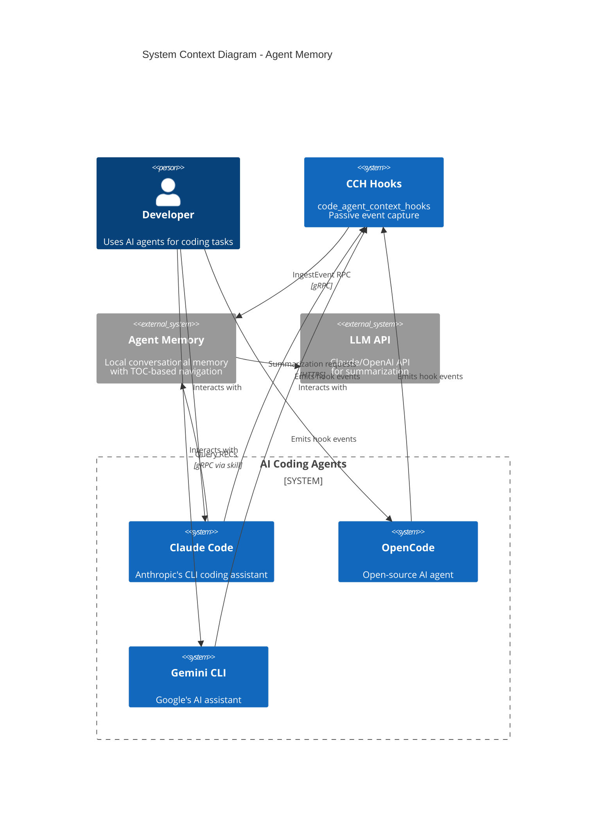
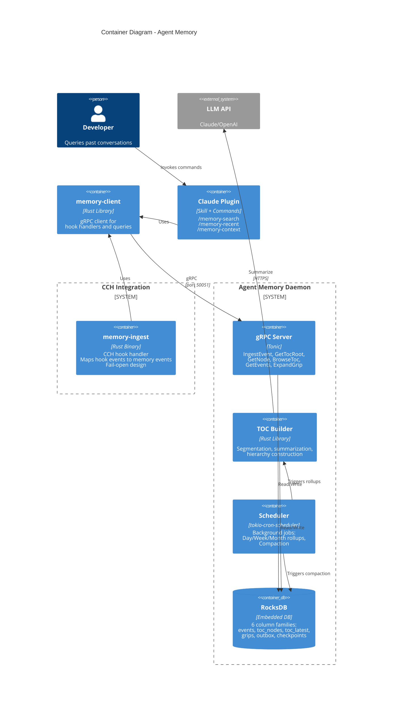
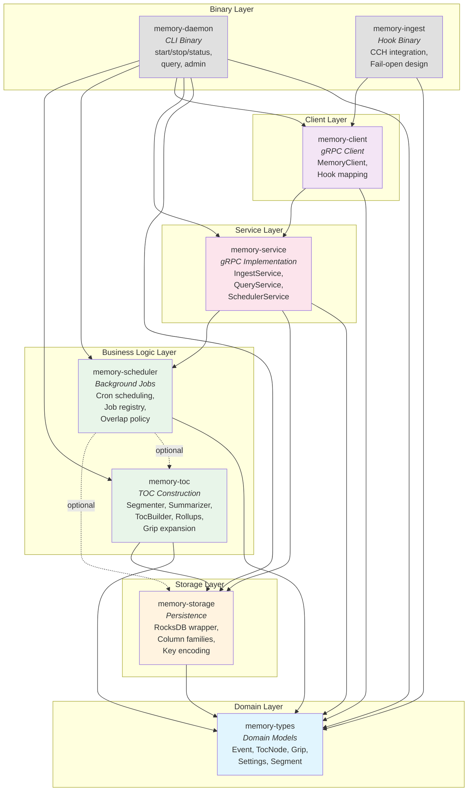
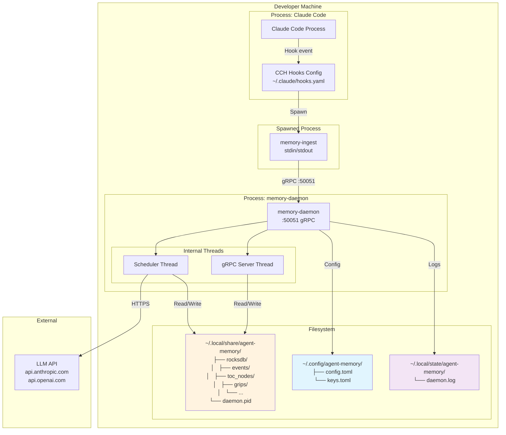

# Architecture Overview

This document provides a comprehensive architectural view of the Agent Memory system, a local, append-only conversational memory for AI agents. The architecture enables agents to answer questions like "what were we discussing last week?" without scanning entire conversation histories.

## Table of Contents

1. [System Context](#1-system-context)
2. [Container Architecture](#2-container-architecture)
3. [Component Architecture](#3-component-architecture)
4. [Deployment Architecture](#4-deployment-architecture)
5. [Design Rationale](#5-design-rationale)

---

## 1. System Context

The System Context diagram shows Agent Memory's position within the broader ecosystem of AI agents and developer tools.



### Actors and Their Roles

| Actor | Role | Interaction Pattern |
|-------|------|---------------------|
| **Developer** | End user who interacts with AI agents for coding tasks | Asks questions, reviews code, debugs issues |
| **Claude Code** | Primary AI coding assistant from Anthropic | Sends conversation events via hooks; queries memory via skill |
| **OpenCode** | Open-source AI agent alternative | Sends conversation events via hooks |
| **Gemini CLI** | Google's command-line AI assistant | Sends conversation events via hooks |
| **CCH Hooks** | Passive event capture system | Intercepts agent events with zero token overhead |
| **Agent Memory** | The subject system - local memory daemon | Stores events, builds TOC, answers queries |
| **LLM API** | External summarization service | Generates summaries from event batches |

### Key Design Decisions at This Level

1. **Passive Capture via Hooks**: Conversation events are captured by CCH hooks that listen to agent activity. This is a zero-token-overhead approach - the hooks capture events without consuming any of the agent's context window.

2. **Local-First Architecture**: Agent Memory runs locally on the developer's machine. There is no cloud dependency for storage - only the optional LLM API for summarization.

3. **Multi-Agent Support**: The system is designed to capture events from multiple AI agents (Claude Code, OpenCode, Gemini CLI), providing a unified memory across different tools.

4. **Fail-Open Integration**: The CCH hook handler uses a fail-open pattern. If the memory daemon is unavailable, the agent continues working normally. Memory capture is best-effort, never blocking.

---

## 2. Container Architecture

The Container diagram shows the major runtime components within the Agent Memory system.



### Container Responsibilities

#### memory-ingest (CCH Hook Handler)

**Purpose**: Bridge between CCH hooks and the memory daemon.

**Key Characteristics**:
- Reads JSON events from stdin (CCH protocol)
- Maps CCH event types to memory event types
- Always outputs `{"continue":true}` - never blocks the agent
- Fail-open: if daemon is unreachable, silently continues

**Event Type Mapping**:
| CCH Event | Memory Event Type |
|-----------|------------------|
| SessionStart | session_start |
| UserPromptSubmit | user_message |
| AssistantResponse | assistant_message |
| PreToolUse | tool_use |
| PostToolUse | tool_result |
| Stop / SessionEnd | session_end |
| SubagentStart | subagent_start |
| SubagentStop | subagent_stop |

#### gRPC Server

**Purpose**: Primary API surface for all interactions with Agent Memory.

**Endpoints**:
| RPC | Purpose | Use Case |
|-----|---------|----------|
| `IngestEvent` | Store a conversation event | Hook handler sends captured events |
| `GetTocRoot` | Get year-level TOC nodes | Agent starts navigation at top level |
| `GetNode` | Get a specific TOC node | Agent drills into a time period |
| `BrowseToc` | Paginated child nodes | Agent explores large node lists |
| `GetEvents` | Raw events in time range | Agent needs original conversation |
| `ExpandGrip` | Context around an excerpt | Agent verifies a summary claim |

**Design Choice**: gRPC-only (no HTTP). This provides a clean, typed contract and avoids framework churn. The protobuf definitions serve as the canonical API specification.

#### TOC Builder

**Purpose**: Construct the hierarchical Table of Contents from raw events.

**Key Operations**:
1. **Segmentation**: Groups events into segments based on time gaps (30 min default) or token count (4000 tokens default)
2. **Summarization**: Calls LLM API to generate title, bullets, keywords for each segment
3. **Grip Extraction**: Creates provenance links between summary bullets and source events
4. **Hierarchy Construction**: Builds Year -> Month -> Week -> Day -> Segment tree

**Why Time-Based Hierarchy?**
Time is the universal organizing principle that humans naturally use. When someone asks "what were we discussing last week?", they're already thinking in time terms. The TOC mirrors this mental model.

#### Scheduler

**Purpose**: Run background maintenance jobs on a cron schedule.

**Scheduled Jobs**:
| Job | Schedule | Purpose |
|-----|----------|---------|
| Day Rollup | `0 0 * * *` | Summarize yesterday's segments into day node |
| Week Rollup | `0 1 * * 1` | Summarize week's days into week node |
| Month Rollup | `0 2 1 * *` | Summarize month's weeks into month node |
| Compaction | `0 3 * * 0` | RocksDB maintenance |

**Features**:
- Cron-based scheduling with timezone support
- Overlap prevention (skip if previous run still active)
- Jitter support for distributed deployments
- Graceful shutdown with in-flight job completion

#### RocksDB Storage

**Purpose**: Persistent, embedded storage with column family isolation.

**Column Families**:
| CF | Key Format | Purpose |
|----|------------|---------|
| `events` | `evt:{timestamp}:{ulid}` | Raw conversation events |
| `toc_nodes` | `toc:{node_id}:v{version}` | Versioned TOC nodes |
| `toc_latest` | `latest:{node_id}` | Latest version pointers |
| `grips` | `grip:{grip_id}` | Excerpt provenance records |
| `outbox` | `out:{sequence}` | Pending async operations |
| `checkpoints` | `chk:{job_name}` | Crash recovery checkpoints |

**Why RocksDB?**
- Embedded: No separate database process to manage
- Fast range scans: Time-prefixed keys enable efficient queries
- Column families: Logical isolation with different compaction strategies
- Proven: Battle-tested in production systems

#### memory-client

**Purpose**: Reusable gRPC client library for interacting with the daemon.

**Consumers**:
- `memory-ingest` hook handler
- Claude Code plugin commands
- CLI query tools

**Features**:
- Connection pooling
- Automatic reconnection
- Type-safe API matching protobuf definitions

#### Claude Plugin

**Purpose**: Expose memory capabilities as Claude Code slash commands.

**Commands**:
| Command | Purpose |
|---------|---------|
| `/memory-search <topic>` | Find conversations about a topic |
| `/memory-recent [--days N]` | Show recent activity summary |
| `/memory-context <grip>` | Expand a grip to see full context |

**Design**: Uses Progressive Disclosure Architecture (PDA) - the agent sees summaries first and drills down only when needed.

---

## 3. Component Architecture

The Component diagram shows the internal structure of the Rust workspace and crate dependencies.



### Crate Descriptions

#### memory-types (Domain Layer)

**Location**: `crates/memory-types/`

**Purpose**: Shared domain models used throughout the system. This is a leaf crate with no internal dependencies.

**Key Types**:

```rust
// Core event structure
pub struct Event {
    pub event_id: String,      // ULID
    pub session_id: String,
    pub timestamp: DateTime<Utc>,
    pub event_type: EventType,
    pub role: EventRole,
    pub text: String,
    pub metadata: HashMap<String, String>,
}

// TOC hierarchy node
pub struct TocNode {
    pub node_id: String,       // e.g., "toc:day:2024-01-15"
    pub level: TocLevel,       // Year, Month, Week, Day, Segment
    pub title: String,
    pub summary: Option<String>,
    pub bullets: Vec<TocBullet>,
    pub keywords: Vec<String>,
    pub child_node_ids: Vec<String>,
    pub start_time: DateTime<Utc>,
    pub end_time: DateTime<Utc>,
    pub version: u32,
}

// Provenance anchor
pub struct Grip {
    pub grip_id: String,
    pub excerpt: String,       // Quoted text from events
    pub event_id_start: String,
    pub event_id_end: String,
    pub timestamp: DateTime<Utc>,
    pub source: String,
}
```

**Design Rationale**: Centralizing domain types in a dedicated crate ensures consistency across all components and prevents circular dependencies.

#### memory-storage (Storage Layer)

**Location**: `crates/memory-storage/`

**Purpose**: RocksDB persistence layer with column family isolation.

**Key Components**:
- `Storage`: Main wrapper providing typed access to RocksDB
- `EventKey`: Time-prefixed key encoding for events
- `column_families`: CF definitions with appropriate compaction strategies

**Key Design**:
```
Event Key Format: evt:{timestamp_ms:013}:{ulid}
                      ├─ Zero-padded 13-digit timestamp
                      └─ 26-character ULID

Example: evt:1706540400000:01HN4QXKN6YWXVKZ3JMHP4BCDE
```

This format enables:
- Efficient range scans by time (lexicographic ordering)
- Unique keys even within the same millisecond (ULID suffix)
- Event ID reconstruction from key

#### memory-toc (Business Logic Layer)

**Location**: `crates/memory-toc/`

**Purpose**: Core business logic for TOC construction, summarization, and navigation.

**Key Components**:
- `Segmenter`: Groups events by time/token boundaries
- `Summarizer` trait: Pluggable summarization (API or local LLM)
- `TocBuilder`: Constructs and updates the TOC hierarchy
- `RollupJob`: Aggregates child summaries into parent nodes
- `GripExpander`: Retrieves context around grip excerpts

**Summarizer Trait**:
```rust
#[async_trait]
pub trait Summarizer: Send + Sync {
    async fn summarize(&self, events: &[Event]) -> Result<Summary, SummarizerError>;
}

pub struct Summary {
    pub title: String,
    pub bullets: Vec<TocBullet>,
    pub keywords: Vec<String>,
    pub grips: Vec<Grip>,
}
```

The trait enables swapping between:
- `ApiSummarizer`: Uses Claude/OpenAI API
- `MockSummarizer`: For testing
- Future: Local LLM summarizer

#### memory-scheduler (Business Logic Layer)

**Location**: `crates/memory-scheduler/`

**Purpose**: Background job scheduling with cron expressions.

**Key Components**:
- `SchedulerService`: Main scheduler using tokio-cron-scheduler
- `JobRegistry`: Tracks job status and history
- `OverlapPolicy`: Skip or allow concurrent executions
- `JitterConfig`: Random delay to spread load

**Features**:
- Timezone-aware scheduling (chrono-tz)
- Graceful shutdown (CancellationToken)
- Observable status via gRPC

#### memory-service (Service Layer)

**Location**: `crates/memory-service/`

**Purpose**: gRPC service implementations.

**Key Components**:
- `MemoryServiceImpl`: Implements IngestEvent and query RPCs
- `SchedulerGrpcService`: Exposes scheduler status/control
- `server`: Server setup with health and reflection

**Server Configuration**:
- Default port: 50051
- Health endpoint: tonic-health
- Reflection: tonic-reflection for debugging

#### memory-client (Client Layer)

**Location**: `crates/memory-client/`

**Purpose**: Reusable gRPC client library.

**Key Components**:
- `MemoryClient`: High-level client with typed methods
- `HookEvent`, `HookEventType`: CCH event mapping
- `map_hook_event`: Converts CCH events to domain events

#### memory-daemon (Binary Layer)

**Location**: `crates/memory-daemon/`

**Purpose**: Main daemon binary with CLI interface.

**Commands**:
```
memory-daemon start           # Start the daemon
memory-daemon stop            # Stop running daemon
memory-daemon status          # Show daemon status

memory-daemon query root      # Show TOC root
memory-daemon query node <id> # Show specific node
memory-daemon query events    # Show events in range

memory-daemon admin compact   # Trigger compaction
memory-daemon admin status    # Show storage stats
memory-daemon admin rebuild   # Rebuild TOC

memory-daemon scheduler status # Show scheduler status
memory-daemon scheduler pause  # Pause a job
memory-daemon scheduler resume # Resume a job
```

#### memory-ingest (Binary Layer)

**Location**: `crates/memory-ingest/`

**Purpose**: CCH hook handler binary.

**Design**:
1. Reads single JSON line from stdin
2. Parses CCH event format
3. Maps to memory event
4. Sends via gRPC (fire-and-forget)
5. Always outputs `{"continue":true}`

### Layered Architecture Benefits

1. **Testability**: Each layer can be tested independently with mocked dependencies
2. **Flexibility**: Implementations can be swapped (e.g., different summarizers)
3. **Clear Boundaries**: Dependency direction is always downward
4. **Reusability**: Client library works for both binaries and plugins

---

## 4. Deployment Architecture

The Deployment diagram shows the local installation topology.



### Directory Structure

#### Data Directory (`~/.local/share/agent-memory/`)

Contains the RocksDB database and runtime files:

```
~/.local/share/agent-memory/
├── rocksdb/                 # RocksDB data directory
│   ├── 000003.log          # Write-ahead log
│   ├── MANIFEST-000001     # Database manifest
│   ├── CURRENT             # Current manifest pointer
│   ├── LOCK                # Process lock file
│   └── *.sst               # SSTable files (sorted data)
├── daemon.pid              # PID file for daemon management
└── daemon.sock             # Unix socket (optional)
```

**Data Durability**: RocksDB provides strong durability guarantees via its write-ahead log (WAL). Data is safe even if the process crashes.

#### Configuration Directory (`~/.config/agent-memory/`)

Contains configuration files:

```
~/.config/agent-memory/
├── config.toml             # Main configuration
└── keys.toml               # API keys (optional)
```

**Sample config.toml**:
```toml
[daemon]
port = 50051
db_path = "~/.local/share/agent-memory/rocksdb"
log_level = "info"

[segmentation]
time_gap_minutes = 30
token_threshold = 4000
overlap_minutes = 5
overlap_tokens = 500

[summarizer]
provider = "anthropic"  # or "openai", "mock"
model = "claude-3-haiku-20240307"

[scheduler]
timezone = "America/Los_Angeles"
day_rollup_cron = "0 0 * * *"
week_rollup_cron = "0 1 * * 1"
month_rollup_cron = "0 2 1 * *"
```

**Configuration Precedence** (highest to lowest):
1. Command-line flags (`--port 50052`)
2. Environment variables (`MEMORY_PORT=50052`)
3. Config file values
4. Built-in defaults

#### Log Directory (`~/.local/state/agent-memory/`)

Contains log files following XDG Base Directory Specification:

```
~/.local/state/agent-memory/
└── daemon.log              # Daemon log file (rotated)
```

### Process Model

#### Daemon Startup

1. Parse CLI arguments and load configuration
2. Check for existing daemon (via PID file)
3. Open RocksDB storage
4. Start gRPC server on configured port
5. Initialize scheduler and register jobs
6. Write PID file
7. Enter main event loop

#### Hook Invocation

When Claude Code captures an event:

1. CCH reads `hooks.yaml` and finds memory-ingest handler
2. CCH spawns `memory-ingest` process
3. CCH writes event JSON to stdin
4. `memory-ingest` parses event, connects to daemon
5. `memory-ingest` sends IngestEvent RPC
6. `memory-ingest` outputs `{"continue":true}` to stdout
7. Process exits (short-lived)

#### Scheduler Execution

1. Scheduler thread sleeps until next job due
2. Checks overlap policy (skip if previous still running)
3. Applies jitter delay if configured
4. Executes job function (e.g., day rollup)
5. Records result in job registry
6. Reschedules next run

---

## 5. Design Rationale

### Why TOC-Based Navigation?

The core insight of Agent Memory is that **agentic search beats brute-force scanning**.

Traditional approaches load entire conversation histories into the agent's context window. This:
- Consumes expensive tokens
- Overwhelms the model with irrelevant information
- Scales poorly as conversations grow

Agent Memory uses a **Progressive Disclosure Architecture**:

```
Level       Example                 Token Cost
─────────────────────────────────────────────────
Year        "2024: authentication"  ~20 tokens
  └─ Week   "Week 3: JWT work"      ~50 tokens
      └─ Day "Thu: token debugging" ~100 tokens
         └─ Segment (summary)       ~500 tokens
            └─ Grip (excerpt)       ~50 tokens
               └─ Events (raw)      ~2000 tokens
```

The agent navigates from high-level summaries to specific details, consuming tokens proportionally to the precision needed.

### Why Append-Only Storage?

Append-only storage provides:

1. **Immutable Truth**: Events cannot be modified after ingestion. The conversation record is a permanent audit log.

2. **Simplified Concurrency**: No need for complex locking or conflict resolution. Concurrent writes are simply appended.

3. **Efficient Writes**: Append-only workloads are ideal for LSM-tree storage (RocksDB). Writes go to memory, then batch-flush to disk.

4. **Easy Crash Recovery**: The outbox pattern ensures events are never lost. If processing fails, the outbox entry remains for retry.

### Why Time-Based Hierarchy?

Time is the natural organizing principle for conversations:

1. **Human Mental Model**: People naturally think "last week" or "yesterday" when recalling conversations.

2. **Universal Structure**: Unlike topics (which require NLP), time-based organization is deterministic.

3. **Efficient Queries**: Time-prefixed keys enable O(log n) lookups via RocksDB range scans.

4. **Incremental Building**: New events slot into existing time buckets. No global reprocessing needed.

### Why Grips for Provenance?

Grips connect summaries to source evidence:

```
Summary Bullet: "Discussed JWT token expiration issues"
       │
       ▼
Grip: {
  excerpt: "The JWT expires after 15 minutes but we need 24 hours",
  event_id_start: "01HN4QXKN6...",
  event_id_end: "01HN4QXMR8..."
}
       │
       ▼
Events: [User message, Assistant response, Tool output]
```

This enables:
- **Verification**: Agent can prove a summary claim by expanding the grip
- **Context**: Additional events before/after the excerpt provide full context
- **Trust**: Users can verify AI-generated summaries against source text

### Why Pluggable Summarization?

The `Summarizer` trait enables different implementations:

| Summarizer | Use Case |
|------------|----------|
| `ApiSummarizer` | Production: high-quality summaries via Claude/OpenAI |
| `MockSummarizer` | Testing: deterministic, no API calls |
| Future: Local LLM | Privacy-sensitive: no data leaves machine |

This flexibility means:
- Tests run fast without API dependencies
- Users can choose their preferred LLM provider
- Future local models can be integrated without architectural changes

### Why Fail-Open Integration?

The CCH hook handler (`memory-ingest`) always succeeds:

```rust
// Even if daemon is down, output success
fn main() {
    // ... try to ingest ...

    // Always return success to CCH
    println!(r#"{{"continue":true}}"#);
}
```

This ensures:
- Claude Code is never blocked by memory issues
- Memory capture is best-effort, not critical path
- Users get a degraded experience (no memory) rather than a broken one

---

## Summary

The Agent Memory architecture embodies these principles:

1. **Agentic Search**: TOC-based navigation enables efficient, targeted retrieval
2. **Local-First**: All data stays on the developer's machine
3. **Append-Only**: Immutable event log provides reliable audit trail
4. **Progressive Disclosure**: Summaries first, details on demand
5. **Fail-Open**: Memory capture never blocks normal agent operation
6. **Pluggable Components**: Summarizers and storage can be swapped

The result is a system that enables AI agents to maintain persistent memory across sessions, answer historical questions efficiently, and provide verifiable evidence for their claims about past conversations.
