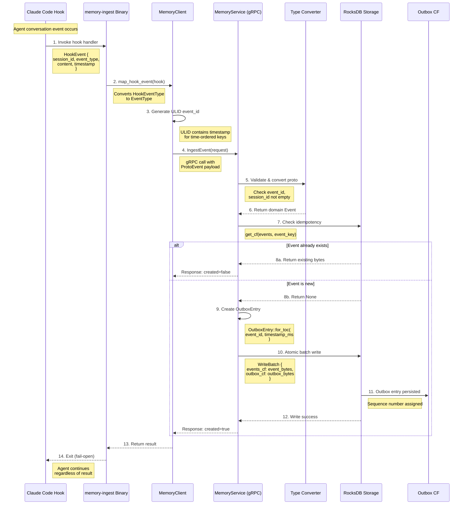
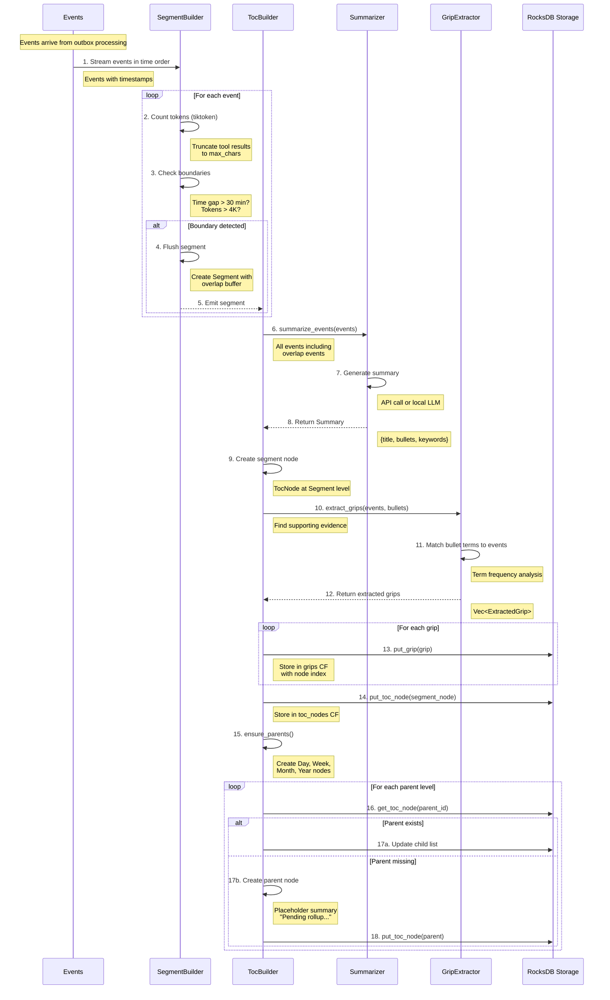
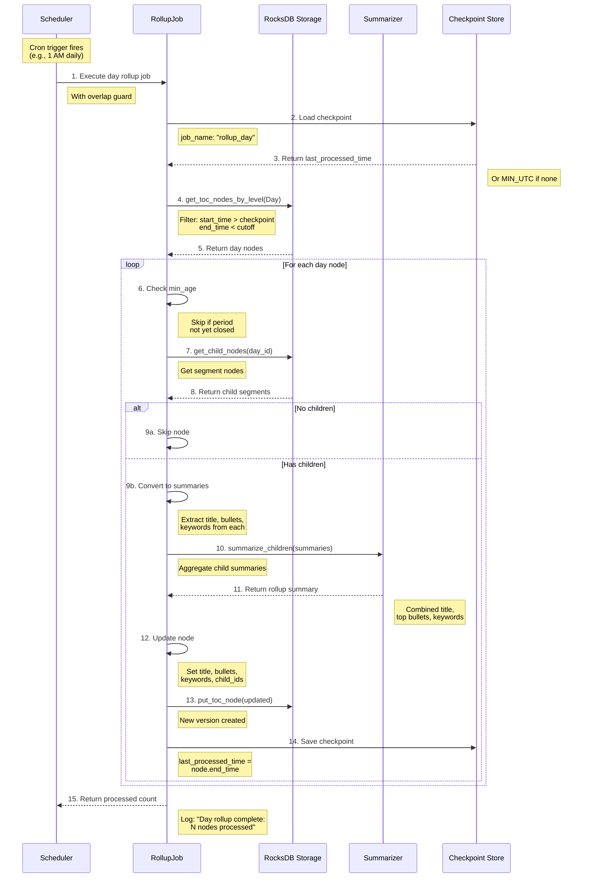
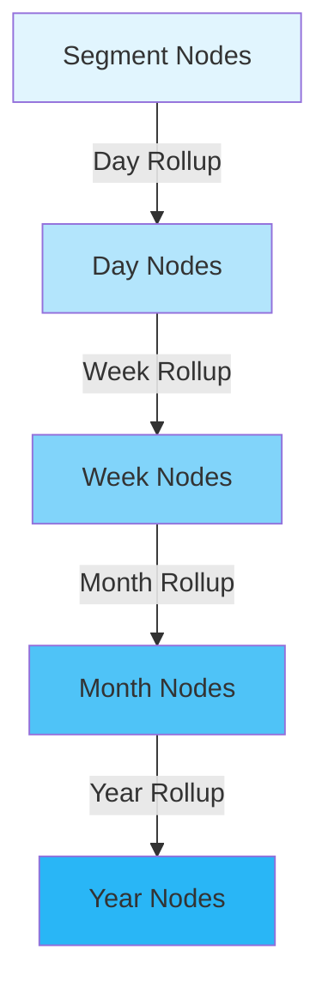
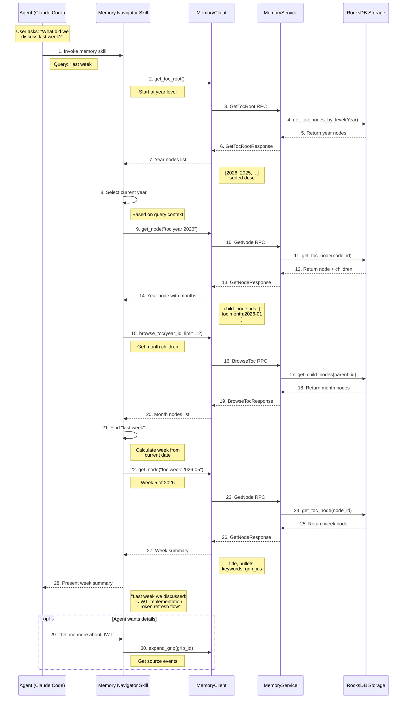
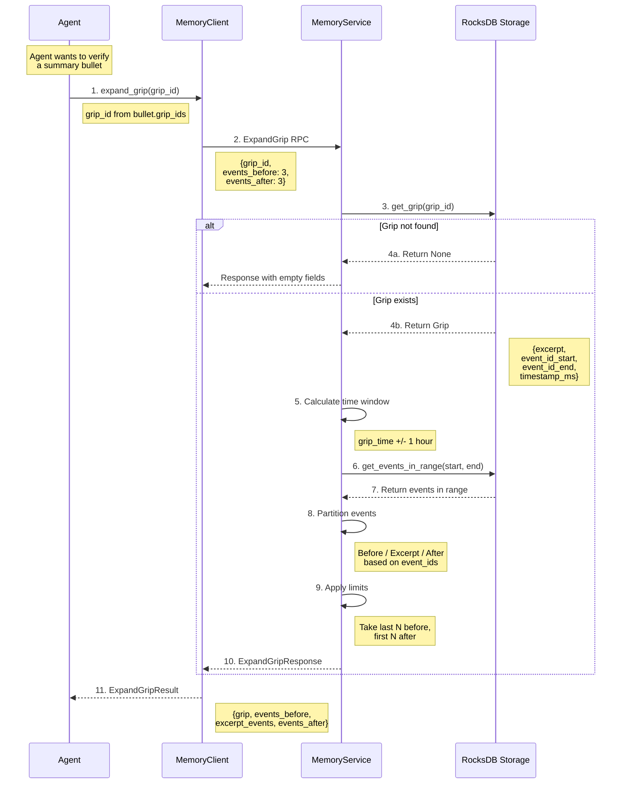

# Data Flow and Sequence Diagrams

This document provides detailed sequence diagrams showing how data flows through the Agent Memory system. Each diagram includes step-by-step explanations, data payloads, and error handling strategies.

## Table of Contents

1. [Event Ingestion Flow](#1-event-ingestion-flow)
2. [TOC Building Flow](#2-toc-building-flow)
3. [TOC Rollup Flow](#3-toc-rollup-flow)
4. [Query Resolution Flow](#4-query-resolution-flow)
5. [Grip Expansion Flow](#5-grip-expansion-flow)

---

## 1. Event Ingestion Flow

The ingestion path captures conversation events from agent hooks and persists them for later retrieval and summarization. This is the entry point for all memory data.

### Why This Design?

The ingestion flow is designed around three key principles:
- **Fail-open**: Never block the agent if memory is down
- **Idempotent**: Duplicate ingestion requests are safe
- **Atomic**: Event and outbox entry are written together or not at all

### Sequence Diagram



### Step-by-Step Explanation

| Step | Component | Action | Data Payload |
|------|-----------|--------|--------------|
| 1 | CCH Hook | Invokes memory-ingest binary | `HookEvent { session_id, event_type, content, timestamp? }` |
| 2 | memory-ingest | Maps hook event to memory event | Converts `HookEventType::UserPromptSubmit` to `EventType::UserMessage` |
| 3 | MemoryClient | Generates unique event ID | ULID string (e.g., `01HRMF...`) containing timestamp |
| 4 | MemoryClient | Sends gRPC request | `IngestEventRequest { event: ProtoEvent }` |
| 5-6 | MemoryService | Validates and converts | Checks required fields, converts proto to domain `Event` |
| 7-8 | Storage | Idempotency check | Returns existing data or None |
| 9 | MemoryService | Creates outbox entry | `OutboxEntry { event_id, timestamp_ms, entry_type: Toc }` |
| 10-11 | Storage | Atomic write | RocksDB `WriteBatch` ensures both succeed or both fail |
| 12-14 | Response path | Returns result | `IngestEventResponse { event_id, created: bool }` |

### Data Payloads at Key Points

**Hook Event (Input)**
```rust
HookEvent {
    session_id: "session-abc123",
    event_type: HookEventType::UserPromptSubmit,
    content: "How do I implement JWT authentication?",
    timestamp: Some(2026-01-31T10:15:30Z),
    tool_name: None,
    metadata: None,
}
```

**Proto Event (Over Wire)**
```protobuf
Event {
    event_id: "01HRMF8K2X3YNPQRSTUVWXYZ",
    session_id: "session-abc123",
    timestamp_ms: 1738318530000,
    event_type: EVENT_TYPE_USER_MESSAGE,
    role: EVENT_ROLE_USER,
    text: "How do I implement JWT authentication?",
    metadata: {},
}
```

**Storage Key**
```
events CF key: <timestamp_ms_be><ulid_random>
             = 0x00000194F2B1E3E0<random_bytes>
```

### Error Handling

| Error Type | Handling Strategy | Impact |
|------------|-------------------|--------|
| Connection failure | Client logs error, returns | Agent continues (fail-open) |
| Invalid event_id | Returns `InvalidArgument` status | Client should retry with valid ID |
| Invalid session_id | Returns `InvalidArgument` status | Client should retry with valid session |
| Storage write failure | Returns `Internal` status | Outbox not written, event not persisted |
| Serialization error | Returns `Internal` status | Logs error for debugging |

### Async vs Sync Operations

- **Synchronous**: The entire ingestion path is synchronous from the agent's perspective
- **Blocking wait**: gRPC call blocks until storage confirms write
- **Why sync?**: Ensures the hook can report success/failure before agent continues

---

## 2. TOC Building Flow

When segments are created from ingested events, the TOC builder creates hierarchical summary nodes. This is where raw events become navigable summaries.

### Why This Design?

The TOC building flow exists because:
- **Progressive Disclosure**: Agents start with summaries, not raw events
- **Time Navigation**: Every event has a place in the Year > Month > Week > Day > Segment hierarchy
- **Provenance**: Grips link summaries back to source events

### Sequence Diagram



### Step-by-Step Explanation

| Step | Component | Action | Output |
|------|-----------|--------|--------|
| 1-3 | SegmentBuilder | Process events, count tokens | Token count per event |
| 4-5 | SegmentBuilder | Detect boundary, emit segment | `Segment { events, overlap_events, token_count }` |
| 6-8 | Summarizer | Generate summary from events | `Summary { title, bullets, keywords }` |
| 9 | TocBuilder | Create segment-level node | `TocNode` with level=Segment |
| 10-12 | GripExtractor | Extract evidence grips | Grips linking bullets to events |
| 13-14 | Storage | Persist grips and node | Written to grips_cf, toc_nodes_cf |
| 15-18 | TocBuilder | Ensure parent hierarchy | Creates missing Day/Week/Month/Year nodes |

### Segmentation Boundaries

The segment builder uses two boundary detection criteria:

```
Time Gap Boundary:
  event.timestamp - last_event.timestamp > 30 minutes

Token Threshold Boundary:
  current_segment_tokens + event_tokens > 4K tokens
```

### Summary Structure

```rust
Summary {
    title: "JWT Authentication Implementation Discussion",
    bullets: [
        "Discussed pros and cons of JWT vs session tokens",
        "Implemented access and refresh token flow",
        "Added token expiration handling",
    ],
    keywords: ["jwt", "authentication", "tokens", "security"],
}
```

### Parent Node Creation

When a segment node is created, the builder ensures all parent nodes exist:

```
Segment: toc:segment:2026-01-31:abc123
    -> Day: toc:day:2026-01-31
        -> Week: toc:week:2026-05  (week 5 of 2026)
            -> Month: toc:month:2026-01
                -> Year: toc:year:2026
```

Parent nodes start with placeholder summaries that get replaced during rollup.

---

## 3. TOC Rollup Flow

Rollup jobs aggregate child summaries into parent summaries, building the time hierarchy from bottom up. This is how higher-level nodes get meaningful content.

### Why This Design?

Rollup serves several purposes:
- **Aggregation**: Combine many segment summaries into daily/weekly/monthly overviews
- **Efficiency**: Pre-compute summaries so queries return instantly
- **Recovery**: Checkpoints enable crash-safe processing

### Sequence Diagram



### Rollup Hierarchy

Rollups execute in order from bottom to top:



### Schedule Configuration

```rust
RollupJobConfig {
    day_cron: "0 0 1 * * *",     // 1 AM daily
    week_cron: "0 0 2 * * 0",    // 2 AM Sunday
    month_cron: "0 0 3 1 * *",   // 3 AM 1st of month
    timezone: "UTC",
    jitter_secs: 300,            // Up to 5 min random delay
}
```

### Minimum Age Requirements

Each rollup level has a minimum age to avoid rolling up incomplete periods:

| Level | Min Age | Rationale |
|-------|---------|-----------|
| Day | 1 hour | Wait for current hour's segments |
| Week | 24 hours | Wait for current day to complete |
| Month | 24 hours | Wait for current day to complete |
| Year | 7 days | Wait for current week to complete |

### Checkpoint Structure

```rust
RollupCheckpoint {
    job_name: "rollup_day",
    level: TocLevel::Day,
    last_processed_time: 2026-01-30T23:59:59Z,
    processed_count: 5,
    created_at: 2026-01-31T01:05:23Z,
}
```

### Error Handling and Recovery

| Failure Point | Recovery Strategy |
|---------------|-------------------|
| Crash during summarization | Restart from checkpoint, re-process node |
| API summarizer timeout | Job fails, retries on next schedule |
| Storage write failure | Checkpoint not saved, node re-processed next run |
| Overlap (job still running) | Skip via OverlapPolicy::Skip |

---

## 4. Query Resolution Flow

When an agent asks "what did we discuss last week?", the query resolution flow navigates the TOC hierarchy to find relevant content.

### Why This Design?

The query path implements Progressive Disclosure:
- **Start broad**: Begin at year or month level
- **Drill down**: Navigate to more specific time periods
- **Verify**: Use grips to confirm with source events

### Sequence Diagram



### Navigation Pattern

The agent navigates down the hierarchy:

```
1. GetTocRoot() -> [Year nodes]
2. BrowseToc(year_id) -> [Month nodes]
3. GetNode(month_id) -> Month summary
4. BrowseToc(month_id) -> [Week nodes]
5. GetNode(week_id) -> Week summary + grip_ids
6. ExpandGrip(grip_id) -> Source events (if needed)
```

### Response Payloads

**Week Node Response**
```rust
TocNode {
    node_id: "toc:week:2026-05",
    level: Week,
    title: "Week 5, 2026",
    bullets: [
        TocBullet {
            text: "Implemented JWT authentication with access and refresh tokens",
            grip_ids: ["grip:1738318530000:jwt123"],
        },
        TocBullet {
            text: "Debugged token expiration race condition",
            grip_ids: ["grip:1738405200000:debug456"],
        },
    ],
    keywords: ["jwt", "authentication", "tokens", "debugging"],
    child_node_ids: [
        "toc:day:2026-01-27",
        "toc:day:2026-01-28",
        ...
    ],
    start_time_ms: 1737936000000,
    end_time_ms: 1738540799000,
}
```

### Pagination

For large result sets, BrowseToc supports pagination:

```
Request 1:
  BrowseToc(parent_id, limit=10, token=None)
  -> children[0..9], continuation_token="10"

Request 2:
  BrowseToc(parent_id, limit=10, token="10")
  -> children[10..19], continuation_token="20"

Request 3:
  BrowseToc(parent_id, limit=10, token="20")
  -> children[20..25], continuation_token=None, has_more=false
```

---

## 5. Grip Expansion Flow

Grips provide provenance - they link summary bullets back to source events. When an agent needs to verify or get context, it expands a grip.

### Why This Design?

Grips solve the "trust but verify" problem:
- **Summaries**: Give agents quick answers
- **Grips**: Let agents verify with source material
- **Context**: Surrounding events help understand the excerpt

### Sequence Diagram



### Step-by-Step Explanation

| Step | Action | Details |
|------|--------|---------|
| 1-2 | Client requests expansion | Includes optional before/after counts |
| 3-4 | Fetch grip from storage | Returns excerpt, event IDs, timestamp |
| 5 | Calculate time window | Default: 1 hour before/after grip timestamp |
| 6-7 | Fetch events in window | Range scan on events column family |
| 8 | Partition events | Three groups based on event_id_start/end |
| 9 | Apply limits | Default: 3 events before, 3 after |
| 10-11 | Return structured result | All three event groups plus grip metadata |

### Grip Structure

```rust
Grip {
    grip_id: "grip:1738318530000:jwt123",
    excerpt: "We should use RS256 for signing JWTs because...",
    event_id_start: "01HRMF8K2X3YNPQ...",  // First event of excerpt
    event_id_end: "01HRMF8K9Z7ABCD...",    // Last event of excerpt
    timestamp: 2026-01-31T10:15:30Z,
    source: "toc:segment:2026-01-31:abc123",
    toc_node_id: Some("toc:segment:2026-01-31:abc123"),
}
```

### Expansion Result

```rust
ExpandGripResult {
    grip: Grip { ... },

    events_before: [
        Event { text: "How should we sign JWTs?", role: User },
        Event { text: "Let me research that...", role: Assistant },
        Event { text: "Read security docs", role: Tool },
    ],

    excerpt_events: [
        Event { text: "We should use RS256 for signing JWTs because it provides asymmetric key security...", role: Assistant },
    ],

    events_after: [
        Event { text: "That makes sense", role: User },
        Event { text: "Great, I'll implement that", role: Assistant },
        Event { text: "Write token.rs", role: Tool },
    ],
}
```

### Context Window Strategy

The expansion uses a time-based window with event count limits:

```
                Time Window (1 hour before/after)
    |--------------------|----------|---------------------|
    |                    |  EXCERPT |                     |
    |    events_before   |  events  |    events_after     |
    |     (limit: 3)     |          |     (limit: 3)      |
    |--------------------|----------|---------------------|
```

This ensures:
- Relevant context is always available
- Response size stays bounded
- Time-adjacent events provide conversational flow

### Error Handling

| Error | Response | Agent Action |
|-------|----------|--------------|
| Grip not found | Empty response | Try different grip_id |
| Event deserialization fails | Skip event, log warning | Partial context returned |
| Time window empty | Empty before/after lists | Excerpt events only |

---

## Summary

The Agent Memory system's data flows are designed around these principles:

1. **Ingestion**: Fast, fail-open, idempotent writes
2. **TOC Building**: Events become segments become summaries
3. **Rollup**: Bottom-up aggregation with crash recovery
4. **Query**: Top-down navigation through time hierarchy
5. **Grip Expansion**: Provenance for verification

Each flow handles errors gracefully, ensuring the agent can always continue working even if memory operations fail.
