# Domain Model Documentation

This document provides comprehensive documentation of the agent-memory domain model, including all entities, their relationships, validation rules, and storage mappings.

## Table of Contents

1. [Overview](#overview)
2. [Core Domain Entities](#core-domain-entities)
3. [Event Type Hierarchy](#event-type-hierarchy)
4. [TOC Hierarchy](#toc-hierarchy)
5. [Grip and Provenance Model](#grip-and-provenance-model)
6. [Storage Schema](#storage-schema)
7. [Configuration Model](#configuration-model)
8. [Design Rationale](#design-rationale)

---

## Overview

The agent-memory system uses an immutable, append-only data model designed for:

- **Durability**: Events are never modified after creation
- **Traceability**: Every summary links back to source evidence via grips
- **Efficient Queries**: Time-based keys enable fast range scans
- **Crash Recovery**: Atomic writes with outbox pattern ensure consistency

### Entity Relationship Overview

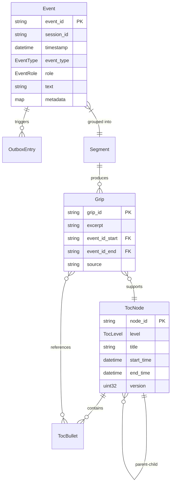

---

## Core Domain Entities

### Event

**Location**: `crates/memory-types/src/event.rs`

Events are the fundamental unit of storage. They represent immutable records of conversation turns, tool calls, session boundaries, and other agent interactions.

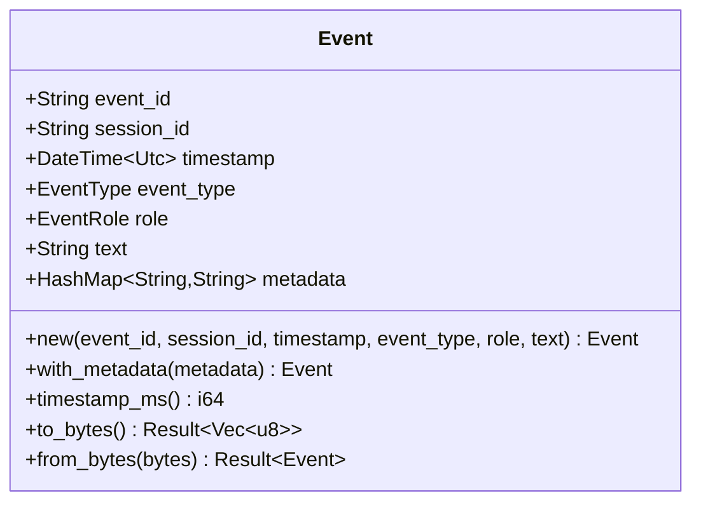

#### Field Descriptions

| Field | Type | Description |
|-------|------|-------------|
| `event_id` | `String` | Unique identifier using ULID format (26 characters). Contains embedded timestamp for ordering. Example: `01HN4QXKN6YWXVKZ3JMHP4BCDE` |
| `session_id` | `String` | Groups events belonging to the same conversation session. Format is application-defined. |
| `timestamp` | `DateTime<Utc>` | Source timestamp when the event occurred (not ingestion time). Per ING-04: Used for chronological ordering. |
| `event_type` | `EventType` | Categorizes the event (see Event Type Hierarchy). |
| `role` | `EventRole` | Author of the message (user, assistant, system, tool). |
| `text` | `String` | Event content. May be empty for boundary events like SessionStart. |
| `metadata` | `HashMap<String, String>` | Extensible key-value pairs for tool names, file paths, model info, etc. |

#### Validation Rules

- `event_id` must be a valid 26-character ULID string
- `timestamp` must not be in the future (at ingestion time)
- `session_id` must not be empty
- `text` may be empty for boundary events (SessionStart, SessionEnd)

#### Immutability Pattern

Events are never modified after creation. This ensures:
1. Audit trail integrity
2. Safe concurrent access
3. Consistent grip references

---

### TocNode

**Location**: `crates/memory-types/src/toc.rs`

TOC (Table of Contents) nodes form a time-based hierarchy for navigating conversation history. They summarize time periods and link to children for drill-down navigation.

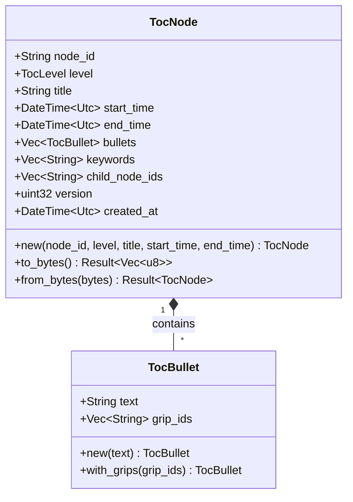

#### Field Descriptions

| Field | Type | Description |
|-------|------|-------------|
| `node_id` | `String` | Unique identifier. Format: `toc:{level}:{date-component}`. Example: `toc:day:2024-01-15` |
| `level` | `TocLevel` | Position in hierarchy (Year, Month, Week, Day, Segment) |
| `title` | `String` | Human-readable display title. Example: "Monday, January 15, 2024" |
| `start_time` | `DateTime<Utc>` | Start of the time period this node covers |
| `end_time` | `DateTime<Utc>` | End of the time period this node covers |
| `bullets` | `Vec<TocBullet>` | Summary bullet points with optional grip references |
| `keywords` | `Vec<String>` | Search/filter tags extracted from content |
| `child_node_ids` | `Vec<String>` | References to child nodes for drill-down |
| `version` | `u32` | Version number for append-only updates (per TOC-06) |
| `created_at` | `DateTime<Utc>` | When this version was created |

#### Versioning Pattern (TOC-06)

TOC nodes are versioned rather than mutated:
1. Each update creates a new version with incremented `version` field
2. A `toc_latest` index points to the current version
3. Historical versions are retained for audit/debugging
4. Key format: `toc:{node_id}:v{version:06}` (zero-padded to 6 digits)

---

### Grip

**Location**: `crates/memory-types/src/grip.rs`

Grips anchor summary excerpts to source events, providing provenance for claims made in TOC bullet points.

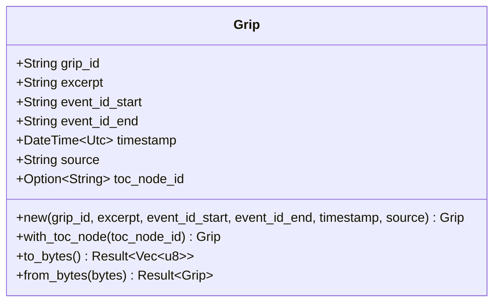

#### Field Descriptions

| Field | Type | Description |
|-------|------|-------------|
| `grip_id` | `String` | Unique identifier. Format: `grip:{timestamp_ms}:{random}`. Example: `grip:1706540400000:test123` |
| `excerpt` | `String` | The text excerpt that this grip anchors. Typically a phrase or sentence from the summarization. |
| `event_id_start` | `String` | ULID of the first event in the range that supports this excerpt |
| `event_id_end` | `String` | ULID of the last event in the range that supports this excerpt |
| `timestamp` | `DateTime<Utc>` | Timestamp of the excerpt (typically from start event) |
| `source` | `String` | Which process produced this grip (e.g., "segment_summarizer", "day_rollup") |
| `toc_node_id` | `Option<String>` | Optional link to the TOC node that uses this grip |

#### Provenance Chain

```
TocBullet.text: "User asked about Rust memory safety"
    |
    +-- TocBullet.grip_ids: ["grip:1706540400000:abc123"]
            |
            +-- Grip.excerpt: "User asked about Rust memory safety"
            +-- Grip.event_id_start: "01HN4QXKN6YWXVKZ3JMHP4BCDE"
            +-- Grip.event_id_end: "01HN4QXKN8ABCDEF1234567890"
                    |
                    +-- Event[start]: "Can you explain Rust's ownership model?"
                    +-- Event[...]: (intermediate events)
                    +-- Event[end]: "Thanks, that clarifies memory safety!"
```

---

### Segment

**Location**: `crates/memory-types/src/segment.rs`

Segments group related events for summarization. They are the leaf nodes of the TOC hierarchy.

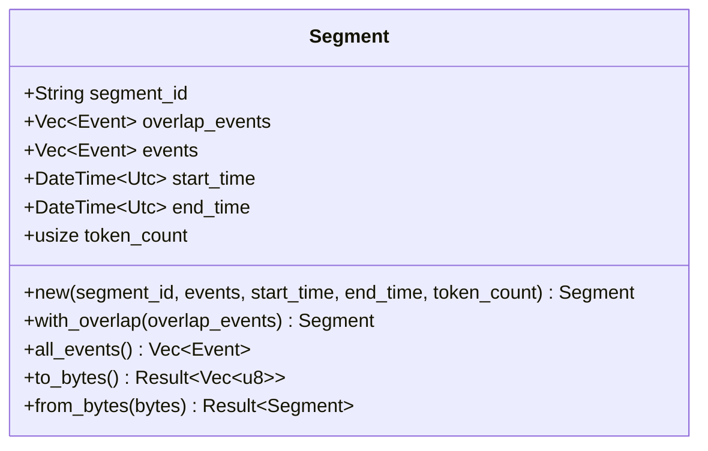

#### Field Descriptions

| Field | Type | Description |
|-------|------|-------------|
| `segment_id` | `String` | Unique identifier for this segment |
| `overlap_events` | `Vec<Event>` | Events from previous segment for context continuity (per TOC-04) |
| `events` | `Vec<Event>` | Main events in this segment (excluding overlap) |
| `start_time` | `DateTime<Utc>` | Timestamp of first event (excluding overlap) |
| `end_time` | `DateTime<Utc>` | Timestamp of last event |
| `token_count` | `usize` | Estimated token count of events (excluding overlap) |

#### Segmentation Rules (TOC-03, TOC-04)

Segments are created based on:
1. **Time threshold**: 30-minute gap between events
2. **Token threshold**: 4K tokens maximum per segment
3. **Overlap window**: Last N events from previous segment included for context

---

### OutboxEntry

**Location**: `crates/memory-types/src/outbox.rs`

Outbox entries enable reliable async processing. They are written atomically with events to ensure index updates are never lost.

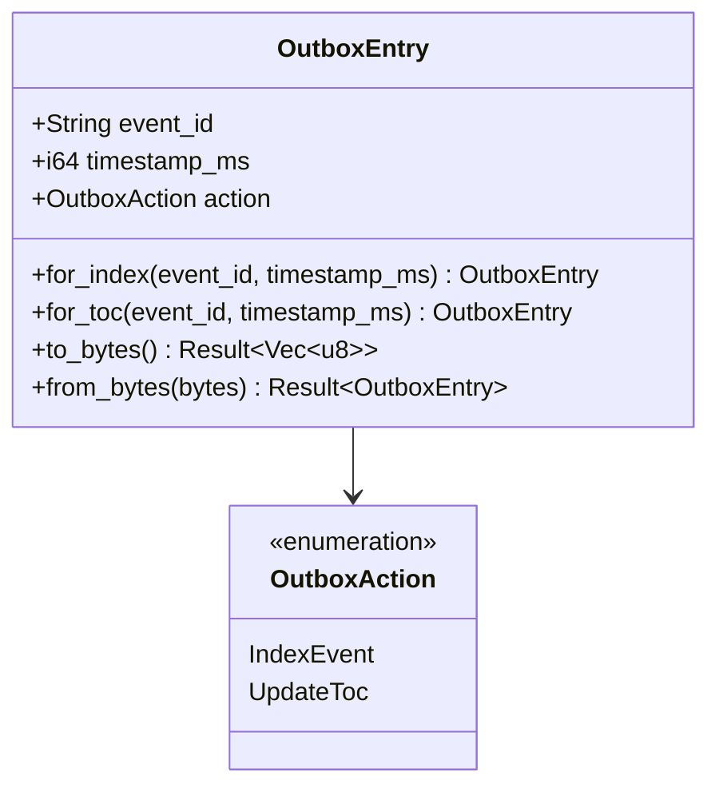

#### Field Descriptions

| Field | Type | Description |
|-------|------|-------------|
| `event_id` | `String` | Reference to the event that triggered this entry |
| `timestamp_ms` | `i64` | Timestamp for ordering (from source event) |
| `action` | `OutboxAction` | What action should be performed |

#### Outbox Pattern (ING-05)

```
1. Client sends IngestEvent request
2. Server atomically writes:
   - Event to CF_EVENTS
   - OutboxEntry to CF_OUTBOX
3. Background worker:
   - Reads OutboxEntry
   - Performs action (index update, TOC update)
   - Deletes OutboxEntry
4. On crash: unprocessed entries are replayed on restart
```

---

## Event Type Hierarchy

Events are categorized by type and role to capture the full conversation lifecycle.

### EventType Enum

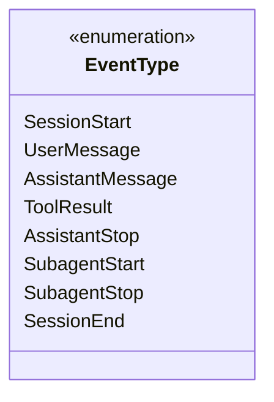

| Value | Description | Typical Role |
|-------|-------------|--------------|
| `SessionStart` | New conversation session began | System |
| `UserMessage` | User submitted a message | User |
| `AssistantMessage` | Assistant generated a response | Assistant |
| `ToolResult` | Tool was called and returned result | Tool |
| `AssistantStop` | Assistant finished responding (turn complete) | Assistant |
| `SubagentStart` | Subagent was spawned for a task | System |
| `SubagentStop` | Subagent completed its task | System |
| `SessionEnd` | Conversation session ended | System |

### EventRole Enum

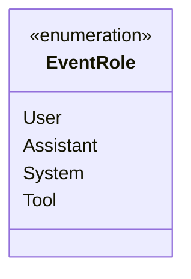

| Value | Description |
|-------|-------------|
| `User` | Human user input |
| `Assistant` | AI assistant response |
| `System` | System-generated events (session boundaries, errors) |
| `Tool` | Tool invocation or result |

### Conversation Flow Example

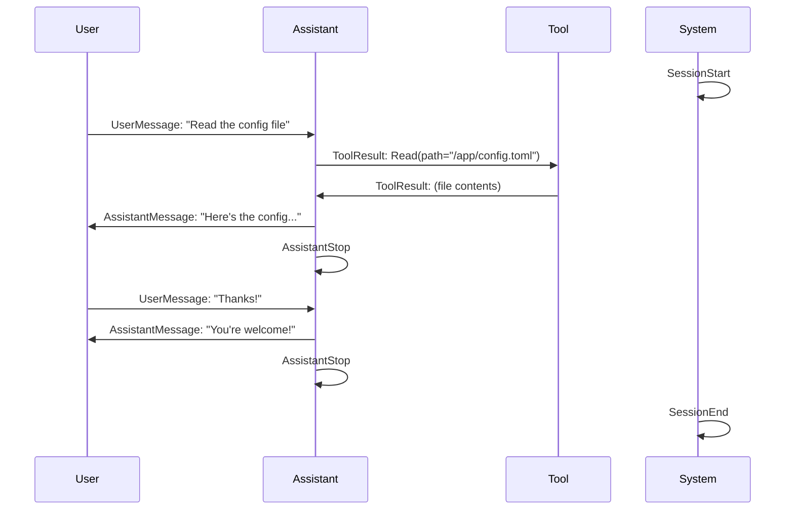

---

## TOC Hierarchy

The Table of Contents provides time-based navigation through conversation history.

### TocLevel Enum

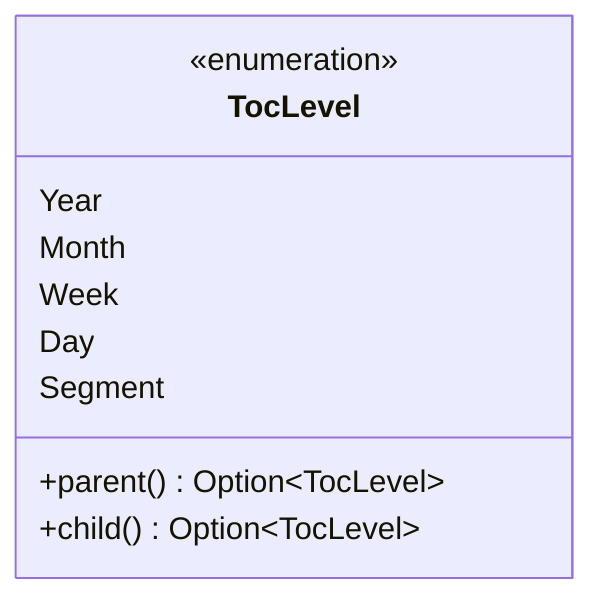

### Hierarchy Structure

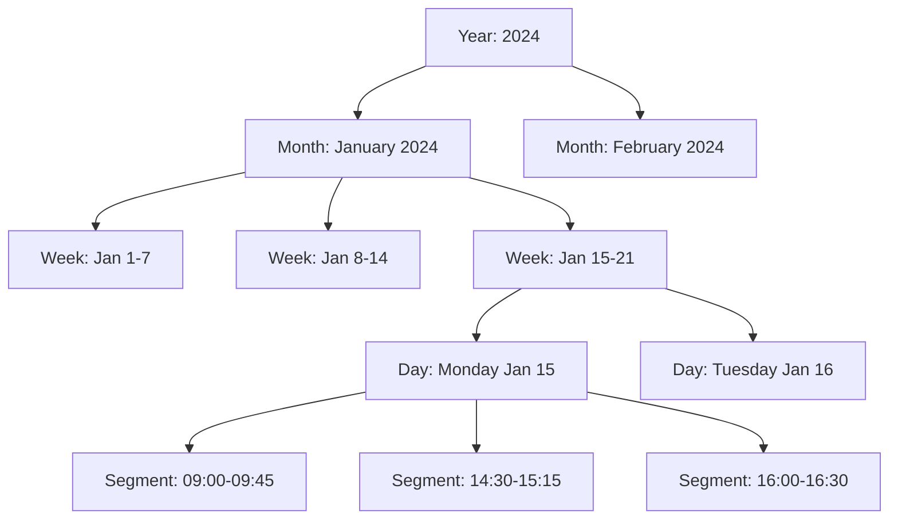

### Level Relationships

| Level | Parent | Child | Example node_id |
|-------|--------|-------|-----------------|
| Year | None | Month | `toc:year:2024` |
| Month | Year | Week | `toc:month:2024-01` |
| Week | Month | Day | `toc:week:2024-W03` |
| Day | Week | Segment | `toc:day:2024-01-15` |
| Segment | Day | None | `toc:segment:2024-01-15:abc123` |

### Navigation API

```rust
// Get root nodes (years)
fn get_toc_root() -> Vec<TocNode>

// Get specific node
fn get_node(node_id: &str) -> Option<TocNode>

// Browse children with pagination
fn browse_toc(parent_id: &str, limit: i32, token: Option<String>)
    -> (Vec<TocNode>, Option<String>, bool)

// Drill down from year to segment
Year -> Month -> Week -> Day -> Segment -> Events
```

---

## Grip and Provenance Model

Grips provide the critical link between summaries and source evidence.

### Grip Context Structure

When expanding a grip, the system returns surrounding context:

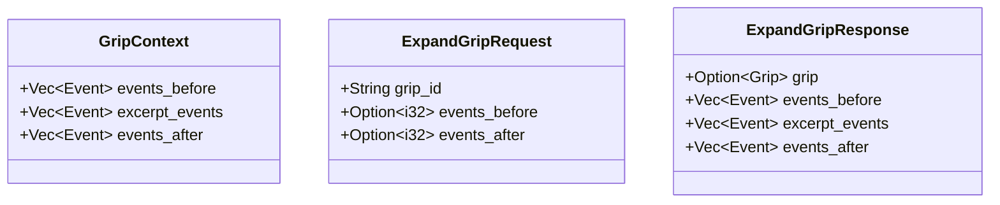

### Context Window Example

```
events_before (context):
  [Event] User: "I'm having trouble with authentication"
  [Event] Assistant: "What error are you seeing?"

excerpt_events (the grip spans these):
  [Event] User: "JWT token expired error"        <- event_id_start
  [Event] Assistant: "That's a common issue..."
  [Event] User: "How do I refresh the token?"
  [Event] Assistant: "Call the refresh endpoint" <- event_id_end

events_after (context):
  [Event] User: "That worked, thanks!"
  [Event] Assistant: "Great! Let me know..."
```

### Provenance Integrity

The grip model ensures:
1. **Verifiability**: Any summary claim can be traced to source events
2. **Context**: Surrounding events provide full conversation context
3. **Non-repudiation**: Events are immutable, grips reference by ID
4. **Auditability**: Grips record which process created them

---

## Storage Schema

### RocksDB Column Families

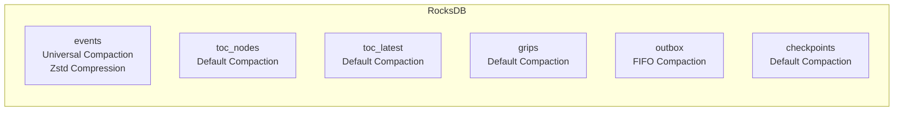

| Column Family | Purpose | Compaction | Compression |
|--------------|---------|------------|-------------|
| `events` | Append-only conversation events | Universal | Zstd |
| `toc_nodes` | TOC hierarchy nodes (versioned) | Default | None |
| `toc_latest` | Latest TOC version pointers | Default | None |
| `grips` | Excerpt-to-event provenance links | Default | None |
| `outbox` | Queue for async index updates | FIFO | None |
| `checkpoints` | Crash recovery job state | Default | None |

### Key Formats

#### EventKey

```
Format: evt:{timestamp_ms:013}:{ulid}
Example: evt:1706540400000:01HN4QXKN6YWXVKZ3JMHP4BCDE

Components:
- prefix: "evt" (identifies key type)
- timestamp_ms: 13-digit zero-padded milliseconds since epoch
- ulid: 26-character ULID for uniqueness
```

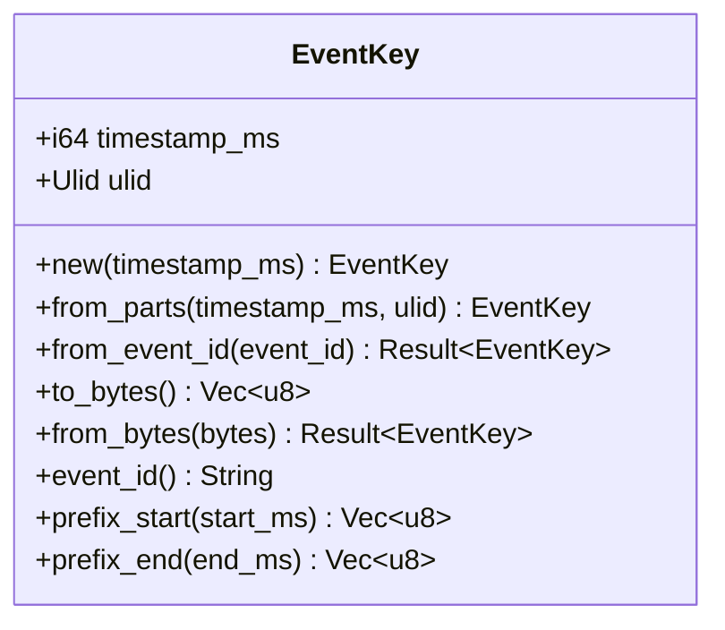

**Design rationale**: Zero-padded timestamp prefix enables efficient lexicographic range scans for time-based queries.

#### OutboxKey

```
Format: outbox:{sequence:020}
Example: outbox:00000000000000012345

Components:
- prefix: "outbox" (identifies key type)
- sequence: 20-digit zero-padded monotonic counter
```

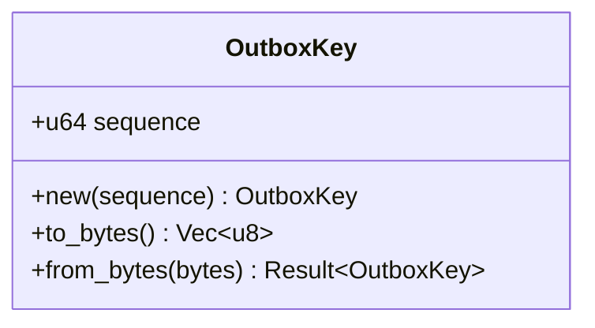

**Design rationale**: Monotonic sequence ensures FIFO processing order.

#### CheckpointKey

```
Format: checkpoint:{job_name}
Example: checkpoint:segmenter

Components:
- prefix: "checkpoint" (identifies key type)
- job_name: Name of the background job
```

### TOC Node Storage

```
Versioned key: toc:{node_id}:v{version:06}
Example: toc:day:2024-01-15:v000001

Latest pointer: latest:{node_id}
Example: latest:toc:day:2024-01-15
Value: version number as 4-byte big-endian u32
```

### Grip Storage

```
Primary key: {grip_id}
Example: grip:1706540400000:test123

Index key (for node lookup): node:{node_id}:{grip_id}
Example: node:toc:day:2024-01-15:grip:1706540400000:test123
Value: empty (index only)
```

### Entity-to-Storage Mapping

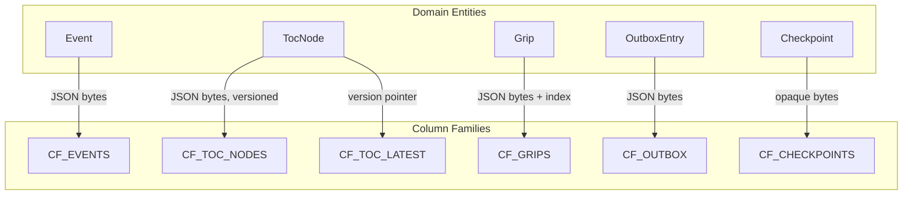

---

## Configuration Model

### Settings Hierarchy

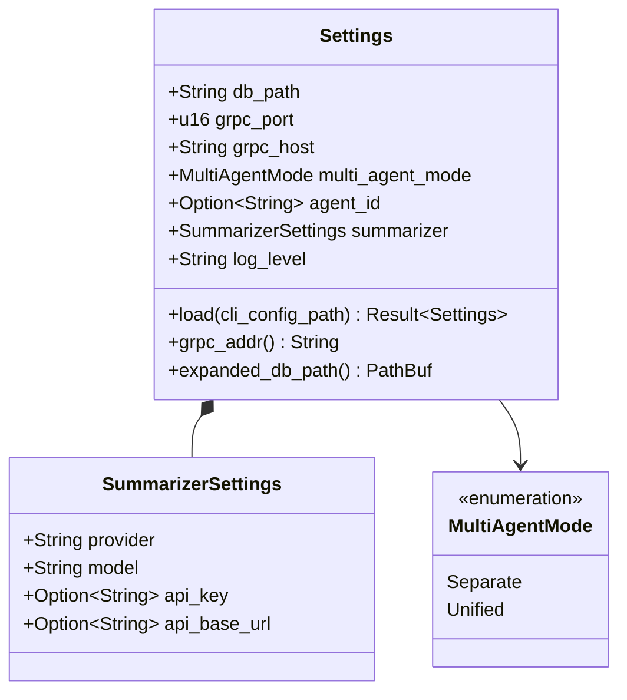

### Field Descriptions

#### Settings

| Field | Type | Default | Description |
|-------|------|---------|-------------|
| `db_path` | `String` | Platform-specific | Path to RocksDB storage directory |
| `grpc_port` | `u16` | 50051 | gRPC server port |
| `grpc_host` | `String` | "0.0.0.0" | gRPC server bind address |
| `multi_agent_mode` | `MultiAgentMode` | Separate | Storage isolation mode |
| `agent_id` | `Option<String>` | None | Agent identifier for unified mode |
| `summarizer` | `SummarizerSettings` | Default | Summarization LLM configuration |
| `log_level` | `String` | "info" | Log verbosity level |

#### SummarizerSettings

| Field | Type | Default | Description |
|-------|------|---------|-------------|
| `provider` | `String` | "openai" | LLM provider (openai, anthropic, local) |
| `model` | `String` | "gpt-4o-mini" | Model name for summarization |
| `api_key` | `Option<String>` | None | API key (from env var, not config file) |
| `api_base_url` | `Option<String>` | None | Custom API endpoint |

### Configuration Layering (CFG-01)

```
Priority (highest to lowest):
1. CLI flags (applied by caller)
2. Environment variables (MEMORY_*)
3. CLI-specified config file
4. Default config file (~/.config/agent-memory/config.toml)
5. Built-in defaults
```

### Multi-Agent Modes (STOR-06)

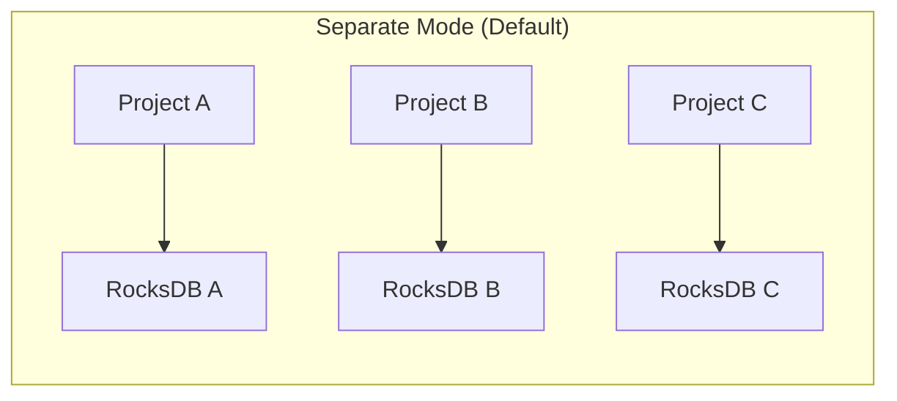

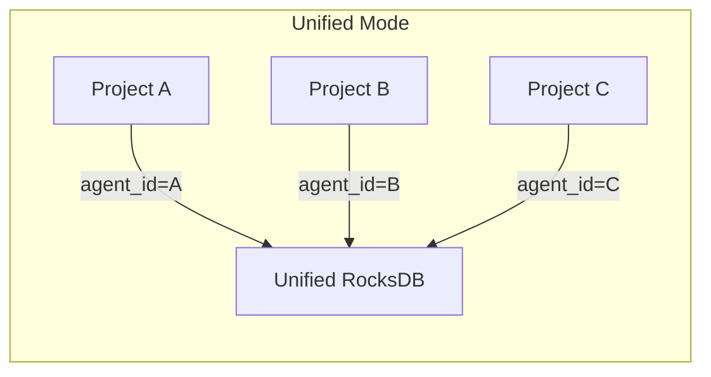

---

## Design Rationale

### Immutability Pattern

**Why**: Events are never modified after creation.

**Benefits**:
- Audit trail integrity - complete history preserved
- Safe concurrent access - no race conditions
- Consistent grip references - event content won't change under grips
- Simplified caching - no invalidation needed

### Append-Only with Versioning

**Why**: TOC nodes append new versions rather than mutating.

**Benefits**:
- Full history of how summaries evolved
- No write conflicts during concurrent updates
- Easy rollback if needed
- Audit trail for summarization changes

### Time-Prefixed Keys

**Why**: Event keys start with zero-padded timestamp.

**Benefits**:
- Lexicographic ordering matches chronological ordering
- Efficient range scans for time-based queries
- No secondary index needed for time queries
- Natural data locality for related events

### Outbox Pattern

**Why**: Atomic writes pair events with outbox entries.

**Benefits**:
- Guaranteed eventual consistency
- Crash-safe async processing
- No lost index updates
- Simple recovery (replay unprocessed entries)

### Grip Provenance

**Why**: Every summary links to source events.

**Benefits**:
- Verifiable claims in summaries
- User can drill down to original context
- Debugging summarization issues
- Trust through transparency

### Column Family Isolation

**Why**: Separate RocksDB column families per data type.

**Benefits**:
- Different compaction strategies per workload
- Events: Universal compaction for append-only
- Outbox: FIFO compaction for queue behavior
- Independent tuning and monitoring

---

## Proto Definitions Reference

The gRPC API mirrors the domain model. See `proto/memory.proto` for:

- `Event`, `EventRole`, `EventType` messages
- `TocNode`, `TocLevel`, `TocBullet` messages
- `Grip` message
- Service RPCs: `IngestEvent`, `GetTocRoot`, `BrowseToc`, `GetEvents`, `ExpandGrip`
- Scheduler RPCs: `GetSchedulerStatus`, `PauseJob`, `ResumeJob`

Key differences from Rust types:
- Timestamps use `int64` milliseconds (not `DateTime<Utc>`)
- Enums have `UNSPECIFIED` zero values
- Optional fields use `optional` keyword
- Maps use protobuf `map<string, string>` syntax
