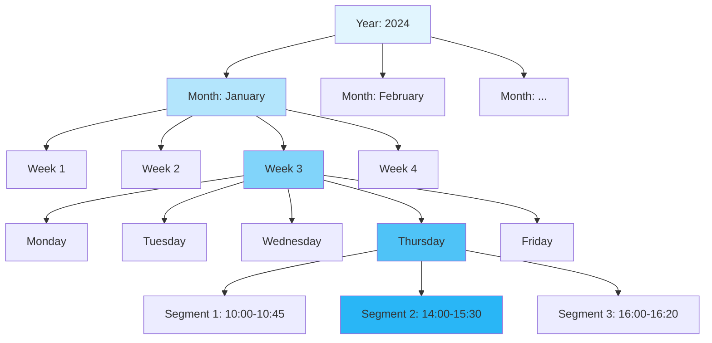
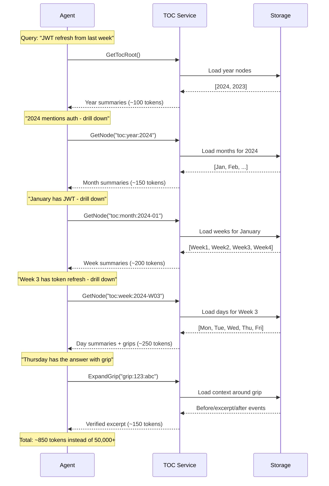
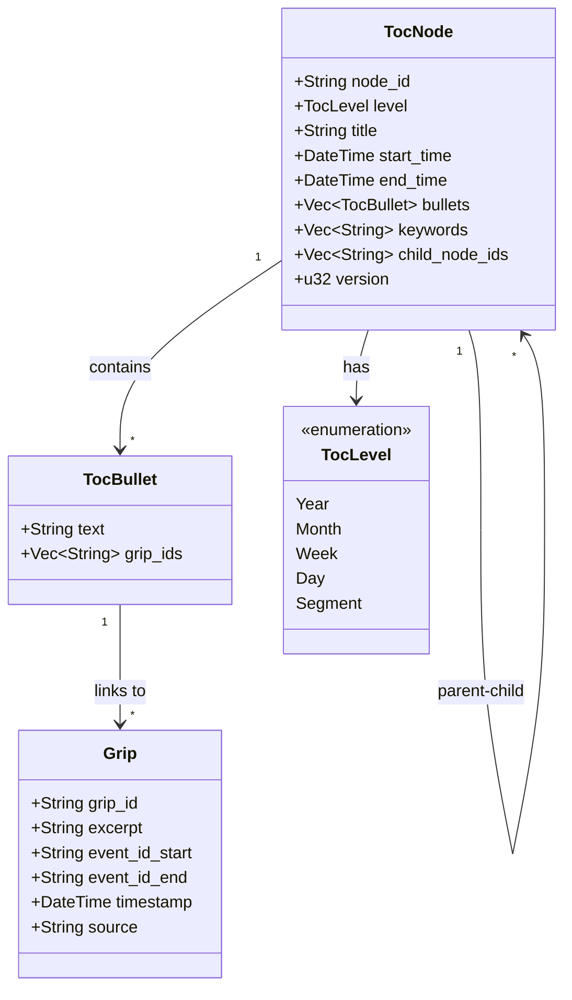
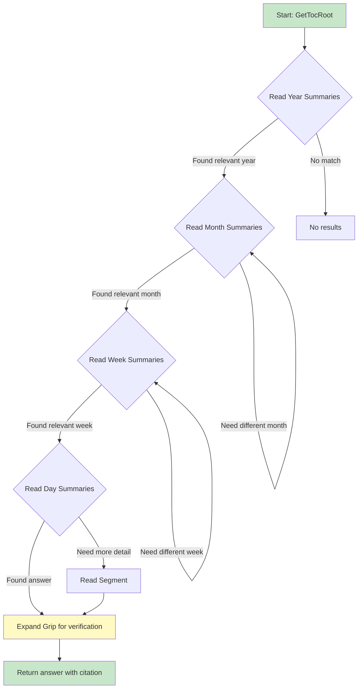
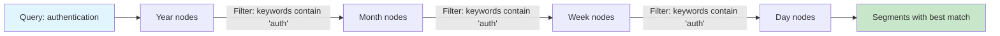
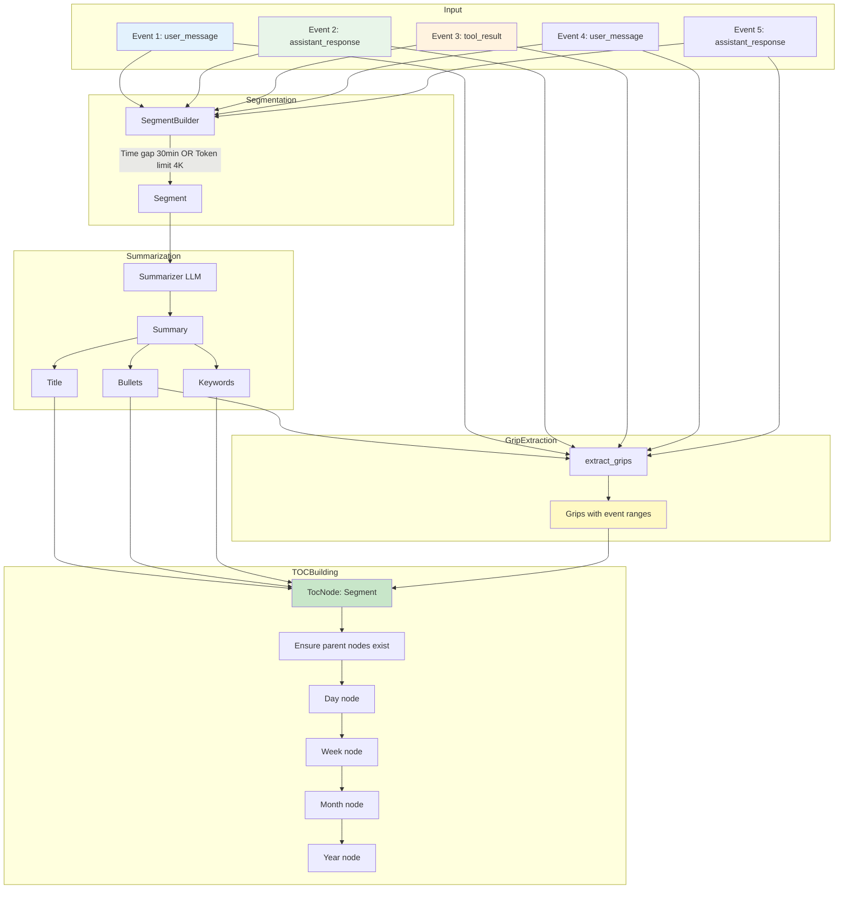
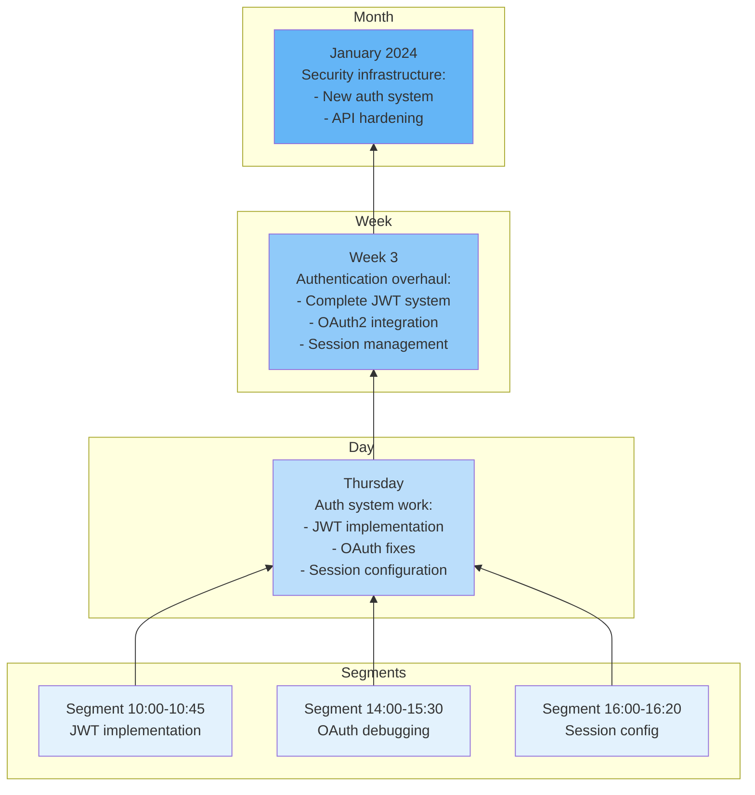
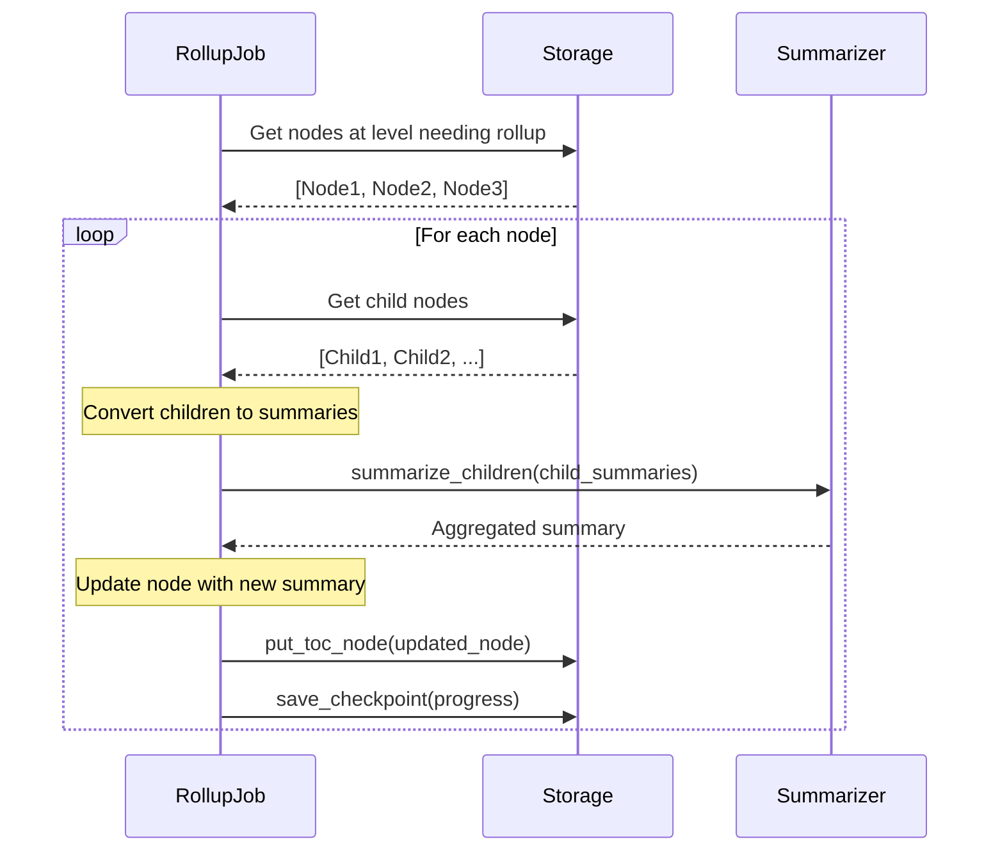
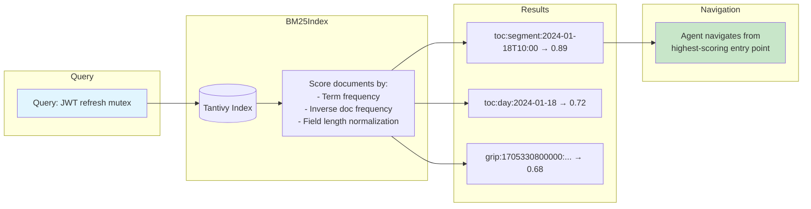
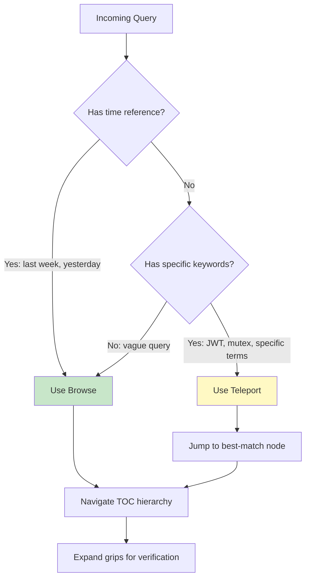

# TOC Navigation & Agentic Search Guide

This guide explains how AI agents navigate the Table of Contents (TOC) to efficiently search conversational memory without brute-force scanning.

## Table of Contents

1. [The Agentic Memory Problem](#the-agentic-memory-problem)
2. [TOC as Agentic Navigation](#toc-as-agentic-navigation)
3. [TOC Node Structure](#toc-node-structure)
4. [Navigation Strategies](#navigation-strategies)
5. [Summarization Pipeline](#summarization-pipeline)
6. [Rollup Process](#rollup-process)
7. [Teleport (BM25 Search)](#teleport-bm25-search)

---

## The Agentic Memory Problem

### Why Brute-Force Search Fails at Scale

Consider an AI coding agent that has been helping a developer for six months. The conversation history might contain:

| Metric | Typical Value | Token Impact |
|--------|---------------|--------------|
| Sessions | 500+ | - |
| Messages | 10,000+ | - |
| Tool results | 5,000+ | Large (often 1KB+ each) |
| Total tokens | 2,000,000+ | Context limit: 200K |

**The fundamental problem**: An agent cannot fit months of conversation history into its context window. Even if it could, scanning 2 million tokens to answer "what did we discuss about authentication last week?" is:

1. **Slow**: Linear scan of all content
2. **Expensive**: Tokens cost money (API calls) or time (local inference)
3. **Inaccurate**: Needle-in-haystack problems increase with corpus size
4. **Context-consuming**: Leaves no room for actual work

### Token Budget Constraints

Modern AI agents operate under strict token budgets:

```
┌─────────────────────────────────────────────────────────────┐
│                    Agent Context Window                      │
│                                                              │
│  ┌──────────────────────────────────────────────────────┐   │
│  │ System Prompt & Instructions           ~2,000 tokens │   │
│  ├──────────────────────────────────────────────────────┤   │
│  │ Current Conversation                   ~5,000 tokens │   │
│  ├──────────────────────────────────────────────────────┤   │
│  │ Tool Results (file contents, etc.)    ~50,000 tokens │   │
│  ├──────────────────────────────────────────────────────┤   │
│  │ ┌────────────────────────────────────────────────┐   │   │
│  │ │ Memory Query Budget        ~500-2,000 tokens   │   │   │
│  │ │ (This is what we have to work with!)           │   │   │
│  │ └────────────────────────────────────────────────┘   │   │
│  ├──────────────────────────────────────────────────────┤   │
│  │ Response Generation Buffer            ~10,000 tokens │   │
│  └──────────────────────────────────────────────────────┘   │
│                                                              │
│  Total Available: ~200,000 tokens                            │
└─────────────────────────────────────────────────────────────┘
```

With only 500-2,000 tokens for memory queries, the agent must be surgical. It cannot afford to load raw conversation history and hope to find what it needs.

### The "What Did We Discuss Last Week?" Challenge

This seemingly simple question illustrates the core challenge:

**Brute-force approach** (does not work):
```
1. Load all events from the past week
2. Scan through each message
3. Try to identify relevant content
4. Summarize findings

Problem: "Last week" might contain 50 sessions, 2,000 messages, 500,000 tokens
Result: Exceeds context, fails to load
```

**Agentic approach** (what we need):
```
1. Navigate to "last week" in the TOC (50 tokens)
2. Read the week summary (100 tokens)
3. Drill down to relevant days if needed (100 tokens)
4. Expand specific excerpts via grips (200 tokens)
5. Return verified answer with citation

Total: ~450 tokens
```

The difference is not incremental improvement - it is the difference between "works" and "does not work at all."

---

## TOC as Agentic Navigation

### The Filing Cabinet Analogy

Think of the TOC as a well-organized filing cabinet for conversations:

```
┌─────────────────────────────────────────────────────────────┐
│                     FILING CABINET                           │
│                                                              │
│  ┌─────────────────────────────────────────────────────┐    │
│  │ 2024 (Year Drawer)                                   │    │
│  │   Summary: "Authentication system, database work"    │    │
│  │   └─────────────────────────────────────────────┐   │    │
│  │   │ January (Month Folder)                       │   │    │
│  │   │   Summary: "JWT implementation, OAuth2"      │   │    │
│  │   │   └─────────────────────────────────────┐   │   │    │
│  │   │   │ Week 3 (Week Tab)                    │   │   │    │
│  │   │   │   Summary: "Token refresh logic"     │   │   │    │
│  │   │   │   └─────────────────────────────┐   │   │   │    │
│  │   │   │   │ Thursday (Day Section)       │   │   │   │    │
│  │   │   │   │   Summary: "Fixed expiration" │   │   │   │    │
│  │   │   │   │   └─────────────────────┐   │   │   │   │    │
│  │   │   │   │   │ Segment 1           │   │   │   │   │    │
│  │   │   │   │   │   (Actual events)   │   │   │   │   │    │
│  │   │   │   │   └─────────────────────┘   │   │   │   │    │
│  │   │   │   └─────────────────────────────┘   │   │   │    │
│  │   │   └─────────────────────────────────────┘   │   │    │
│  │   └─────────────────────────────────────────────┘   │    │
│  └─────────────────────────────────────────────────────┘    │
└─────────────────────────────────────────────────────────────┘
```

Just as you would not read every document in a cabinet to find last week's notes, an agent should not scan every conversation event.

### Hierarchical Time-Based Structure

The TOC organizes conversations into a strict five-level hierarchy:



**Level Definitions**:

| Level | Typical Coverage | Typical Children | Summary Size |
|-------|-----------------|------------------|--------------|
| Year | 365 days | 12 months | 3-5 bullets |
| Month | 28-31 days | 4-5 weeks | 5-8 bullets |
| Week | 7 days | 5-7 days (active) | 5-10 bullets |
| Day | 24 hours | 1-10 segments | 3-8 bullets |
| Segment | 5-45 minutes | None (leaf) | 2-5 bullets |

### How Agents Drill Down Efficiently

The agent's navigation follows a predictable pattern:



**Token efficiency analysis**:
- 5 API calls to navigate
- ~850 tokens total consumed
- Verified answer with citation
- Alternative (brute-force): 50,000+ tokens, may not even fit

---

## TOC Node Structure

### Anatomy of a TocNode

Each node in the TOC contains structured summary information:

```rust
pub struct TocNode {
    /// Unique identifier (e.g., "toc:week:2024-W03")
    pub node_id: String,

    /// Level in hierarchy (Year, Month, Week, Day, Segment)
    pub level: TocLevel,

    /// Human-readable title (e.g., "Week of January 15-21")
    pub title: String,

    /// Start of time period covered
    pub start_time: DateTime<Utc>,

    /// End of time period covered
    pub end_time: DateTime<Utc>,

    /// Summary bullet points with optional grip links
    pub bullets: Vec<TocBullet>,

    /// Keywords for filtering and search
    pub keywords: Vec<String>,

    /// IDs of child nodes for drill-down
    pub child_node_ids: Vec<String>,

    /// Version for append-only updates
    pub version: u32,
}
```

### Node Structure Diagram



### Example Node (Week Level)

```json
{
  "node_id": "toc:week:2024-W03",
  "level": "week",
  "title": "Week of January 15-21, 2024",
  "start_time": "2024-01-15T00:00:00Z",
  "end_time": "2024-01-21T23:59:59Z",
  "bullets": [
    {
      "text": "Implemented JWT token refresh with sliding window",
      "grip_ids": ["grip:1705330800000:01HN4QXKN6YWXVKZ3JMHP4BCDE"]
    },
    {
      "text": "Fixed OAuth2 callback URL handling for production",
      "grip_ids": ["grip:1705417200000:01HN5RYLM7ZAXWLY4KNIQ5CDEF"]
    },
    {
      "text": "Added session timeout configuration options",
      "grip_ids": []
    }
  ],
  "keywords": ["jwt", "refresh", "oauth", "callback", "session", "timeout"],
  "child_node_ids": [
    "toc:day:2024-01-15",
    "toc:day:2024-01-16",
    "toc:day:2024-01-17",
    "toc:day:2024-01-18",
    "toc:day:2024-01-19"
  ],
  "version": 3
}
```

### Grip Linkages for Provenance

Grips connect summary bullets to the original conversation evidence:

```
┌──────────────────────────────────────────────────────────────┐
│ TocNode: Week of January 15-21                                │
│                                                               │
│ Bullets:                                                      │
│   [1] "Implemented JWT token refresh..."  ─────┐              │
│   [2] "Fixed OAuth2 callback URL..."      ─────┼──────┐       │
│   [3] "Added session timeout config"           │      │       │
│                                                │      │       │
└──────────────────────────────────────────────────────────────┘
                                                 │      │
                    ┌────────────────────────────┘      │
                    │                                   │
                    ▼                                   ▼
┌───────────────────────────────────┐  ┌───────────────────────────────────┐
│ Grip: grip:1705330800000:01HN4... │  │ Grip: grip:1705417200000:01HN5... │
│                                   │  │                                   │
│ excerpt: "User asked how to       │  │ excerpt: "The OAuth callback      │
│   refresh JWT without logout"     │  │   fails in production due to..."  │
│                                   │  │                                   │
│ event_id_start: evt:1705330800... │  │ event_id_start: evt:1705417200... │
│ event_id_end:   evt:1705330900... │  │ event_id_end:   evt:1705417300... │
│                                   │  │                                   │
│ ExpandGrip returns:               │  │ ExpandGrip returns:               │
│   - 3 events before               │  │   - 3 events before               │
│   - excerpt events                │  │   - excerpt events                │
│   - 3 events after                │  │   - 3 events after                │
└───────────────────────────────────┘  └───────────────────────────────────┘
```

**Why grips matter**:
1. **Verification**: Agent can confirm summary accuracy
2. **Context**: Surrounding events provide full picture
3. **Citation**: Can reference specific conversation moments
4. **Trust**: User can verify agent's claims

---

## Navigation Strategies

### Strategy 1: Top-Down Browsing

**When to use**: General exploration, time-based queries ("last week", "yesterday")



**Token cost analysis**:

| Step | Tokens | Cumulative |
|------|--------|------------|
| GetTocRoot | 50-100 | 100 |
| GetNode (year) | 100-200 | 300 |
| GetNode (month) | 150-250 | 550 |
| GetNode (week) | 200-300 | 850 |
| GetNode (day) | 100-200 | 1050 |
| ExpandGrip | 150-300 | 1350 |

**Worst case**: ~1,500 tokens to reach verified answer
**Best case**: ~400 tokens if answer found at week level

### Strategy 2: Time-Range Queries

**When to use**: Specific time periods ("January 15-18", "the 3pm meeting")

```python
# Agent pseudo-code for time-range query
def query_time_range(start: datetime, end: datetime, topic: str):
    # Calculate which TOC nodes cover this range
    nodes = []

    if spans_years(start, end):
        nodes = get_year_nodes_in_range(start, end)
    elif spans_months(start, end):
        nodes = get_month_nodes_in_range(start, end)
    elif spans_weeks(start, end):
        nodes = get_week_nodes_in_range(start, end)
    elif spans_days(start, end):
        nodes = get_day_nodes_in_range(start, end)
    else:
        nodes = get_segment_nodes_in_range(start, end)

    # Filter by topic keywords
    relevant = [n for n in nodes if topic_matches(n.keywords, topic)]

    return relevant
```

### Strategy 3: Keyword Filtering

**When to use**: Topic-specific queries ("authentication", "that database bug")

Keywords are extracted during summarization and stored at each level:

```
Year 2024:
  keywords: ["auth", "database", "rust", "testing", "deployment"]

  Month January:
    keywords: ["jwt", "oauth", "session", "token"]

    Week 3:
      keywords: ["refresh", "expiration", "sliding-window"]
```

**Agent filtering approach**:



### Strategy 4: Grip Expansion for Provenance

**When to use**: Verifying claims, getting full context

Grips provide a "zoom lens" into the original conversation:

```
┌─────────────────────────────────────────────────────────────────┐
│ ExpandGrip Request                                               │
│   grip_id: "grip:1705330800000:01HN4QXKN6YWXVKZ3JMHP4BCDE"      │
│   before: 3  (events before excerpt)                             │
│   after: 3   (events after excerpt)                              │
└─────────────────────────────────────────────────────────────────┘
                              │
                              ▼
┌─────────────────────────────────────────────────────────────────┐
│ ExpandGrip Response                                              │
│                                                                  │
│ BEFORE (context leading up to excerpt):                          │
│   [User]: "I'm having issues with JWT tokens expiring"           │
│   [Assistant]: "Let me look at your token configuration..."      │
│   [Tool Result]: token_config.rs contents...                     │
│                                                                  │
│ EXCERPT (the referenced conversation):                           │
│   [User]: "How do we refresh JWT without forcing logout?"        │
│   [Assistant]: "We can implement a sliding window approach..."   │
│                                                                  │
│ AFTER (what happened next):                                      │
│   [User]: "What about the race condition with multiple tabs?"    │
│   [Assistant]: "Good point. We should add a mutex..."            │
│   [Tool Result]: Updated token_refresh.rs                        │
│                                                                  │
└─────────────────────────────────────────────────────────────────┘
```

### Comparison: Navigation Strategies

| Strategy | Best For | Token Cost | Accuracy |
|----------|----------|------------|----------|
| Top-down browsing | General exploration | Medium (500-1500) | High |
| Time-range | Specific periods | Low (200-800) | Very High |
| Keyword filtering | Topic search | Medium (400-1200) | High |
| Grip expansion | Verification | Low (150-300) | Exact |
| Teleport (BM25) | Known terms | Very Low (100-400) | Medium-High |

---

## Summarization Pipeline

### Overview: From Events to Summaries

The summarization pipeline transforms raw conversation events into navigable TOC nodes:



### Step 1: Segment Creation from Events

Segments group related events for summarization. The `SegmentBuilder` creates boundaries based on:

**Time threshold** (default: 30 minutes):
```
Event at 10:00 ─┐
Event at 10:15 ─┤ Segment 1
Event at 10:30 ─┘
                    ← 45 minute gap (exceeds 30 min threshold)
Event at 11:15 ─┐
Event at 11:20 ─┤ Segment 2
Event at 11:45 ─┘
```

**Token threshold** (default: 4,000 tokens):
```
Event 1: 500 tokens  ─┐
Event 2: 800 tokens  ─┤
Event 3: 1200 tokens ─┤ Segment 1 (2,500 tokens)
                      │
Event 4: 2000 tokens ─┘ ← Would exceed 4K, start new segment

Event 4: 2000 tokens ─┐
Event 5: 1500 tokens ─┤ Segment 2 (3,500 tokens)
```

**Overlap for context continuity** (default: 5 min or 500 tokens):
```
Segment 1: [E1, E2, E3, E4, E5]
                    └─────────┘
                    Overlap buffer
                        │
                        ▼
Segment 2: [E4, E5, E6, E7, E8]  ← E4, E5 provide context
           └─────┘
           Overlap from Segment 1
```

### Step 2: Summary Generation with LLM

The `Summarizer` trait abstracts LLM-based summarization:

```rust
pub trait Summarizer: Send + Sync {
    /// Summarize a list of events into title, bullets, keywords
    async fn summarize_events(&self, events: &[Event]) -> Result<Summary, SummarizerError>;

    /// Aggregate child summaries into parent summary (for rollups)
    async fn summarize_children(&self, children: &[Summary]) -> Result<Summary, SummarizerError>;
}
```

**LLM prompt structure** (conceptual):

```
Given these conversation events, create a summary:

Events:
- [User 10:00]: "How do I implement JWT refresh tokens?"
- [Assistant 10:01]: "You can use a sliding window approach..."
- [User 10:05]: "What about the race condition?"
- [Assistant 10:06]: "We should add mutex protection..."

Generate:
1. Title (brief, descriptive)
2. Bullets (3-5 key points)
3. Keywords (5-10 searchable terms)
```

**Output**:
```json
{
  "title": "JWT Token Refresh Implementation",
  "bullets": [
    "Discussed sliding window approach for token refresh",
    "Identified race condition with multiple browser tabs",
    "Solution: Add mutex protection for refresh operations"
  ],
  "keywords": ["jwt", "refresh", "token", "race-condition", "mutex", "sliding-window"]
}
```

### Step 3: Bullet and Keyword Extraction

Keywords are extracted through a combination of:

1. **LLM extraction**: Model identifies key technical terms
2. **Named entity recognition**: Project names, libraries, concepts
3. **Frequency analysis**: Terms that appear often in the segment

**Keyword propagation**:
```
Segment keywords: ["jwt", "refresh", "mutex"]
                            ↓ bubble up
Day keywords:     ["jwt", "refresh", "mutex", "oauth", "session"]
                            ↓ aggregate
Week keywords:    ["authentication", "jwt", "oauth", "session", "security"]
                            ↓ summarize
Month keywords:   ["auth", "database", "deployment"]
```

### Step 4: Grip Creation for Evidence

Grips are created by matching bullet text to source events:

```rust
pub fn extract_grips(
    events: &[Event],
    bullets: &[String],
    source_node_id: &str,
) -> Vec<ExtractedGrip> {
    // For each bullet, find events that best support it
    // Create grip with excerpt and event range
}
```

**Matching algorithm**:
1. Tokenize bullet into key terms
2. Score each event by term overlap
3. Find contiguous event range with highest score
4. Create grip with excerpt from best-matching event

```
Bullet: "Discussed sliding window approach for token refresh"

Events scored:
  E1: "How do I implement JWT refresh tokens?"     → Score: 2 (refresh, tokens)
  E2: "You can use a sliding window approach..."   → Score: 4 (sliding, window, approach, refresh)
  E3: "What about the race condition?"             → Score: 0

Best match: E1-E2 range
Grip excerpt: "sliding window approach for token refresh"
```

---

## Rollup Process

### Progressive Abstraction: Child to Parent

Rollups aggregate child node summaries into parent node summaries:



### Rollup Job Mechanics

The `RollupJob` processes each level with different timing:

```rust
pub fn create_all(storage: Arc<Storage>, summarizer: Arc<dyn Summarizer>) -> Vec<Self> {
    vec![
        Self::new(storage.clone(), summarizer.clone(), TocLevel::Day, Duration::hours(1)),
        Self::new(storage.clone(), summarizer.clone(), TocLevel::Week, Duration::hours(24)),
        Self::new(storage.clone(), summarizer.clone(), TocLevel::Month, Duration::hours(24)),
        Self::new(storage.clone(), summarizer.clone(), TocLevel::Year, Duration::days(7)),
    ]
}
```

**Timing rationale**:

| Level | Min Age Before Rollup | Why |
|-------|----------------------|-----|
| Day | 1 hour | Allow segments to accumulate |
| Week | 24 hours | Don't roll up incomplete weeks |
| Month | 24 hours | Wait for week rollups |
| Year | 7 days | Infrequent updates sufficient |

### Rollup Aggregation Logic



### Checkpoint Recovery

Rollup jobs maintain checkpoints for crash recovery:

```rust
pub struct RollupCheckpoint {
    pub job_name: String,           // e.g., "rollup_day"
    pub level: TocLevel,            // Which level we're processing
    pub last_processed_time: DateTime<Utc>,  // Resume point
    pub processed_count: usize,     // Progress tracking
    pub created_at: DateTime<Utc>,  // When checkpoint was saved
}
```

**Recovery flow**:
```
On Startup:
1. Load checkpoint for "rollup_day"
2. If checkpoint exists:
   - Resume from last_processed_time
   - Skip already-processed nodes
3. If no checkpoint:
   - Start from beginning
   - Process all eligible nodes
4. Save checkpoint after each node
5. On crash: Restart from last checkpoint
```

**Idempotency guarantee**: Processing the same node twice is safe because:
- Nodes are versioned (append-only)
- Same inputs produce same outputs
- Storage operations are atomic

---

## Teleport (BM25 Search)

### When Navigation Is Not Enough

Top-down navigation works well for time-based queries, but some queries need direct access:

| Query Type | Navigation | Teleport |
|------------|------------|----------|
| "Last week's discussions" | Excellent | Unnecessary |
| "The JWT refresh bug" | Good (if recent) | Better |
| "That thing about mutexes" | Poor (when was it?) | Excellent |
| "Authentication" (general) | Poor (too broad) | Good starting point |

### How BM25 Teleport Works

BM25 (Best Matching 25) provides keyword-based search with relevance scoring:



### Browse vs. Teleport Decision Matrix



### Score-Based Ranking

BM25 scores indicate relevance confidence:

| Score Range | Interpretation | Action |
|-------------|---------------|--------|
| 0.8 - 1.0 | Excellent match | Jump directly, high confidence |
| 0.5 - 0.8 | Good match | Jump and verify with context |
| 0.3 - 0.5 | Partial match | Consider multiple results |
| 0.0 - 0.3 | Weak match | Fall back to browse |

### Example: Teleport in Action

```
Query: "sliding window token refresh"

Step 1: BM25 Search
─────────────────────
Results:
  1. grip:1705330800000:01HN4... (score: 0.92)
     excerpt: "sliding window approach for token refresh"

  2. toc:segment:2024-01-18T10:00:... (score: 0.85)
     title: "JWT Token Refresh Implementation"

  3. toc:day:2024-01-18 (score: 0.71)
     bullets: ["Implemented JWT token refresh..."]

Step 2: Agent Chooses Entry Point
──────────────────────────────────
"Score 0.92 for grip is high confidence. Let me expand it directly."

Step 3: ExpandGrip
──────────────────
Returns full context around "sliding window approach for token refresh"

Step 4: Verify and Respond
──────────────────────────
Agent has verified answer with source evidence.
Total tokens: ~200 (vs ~1500 for full browse)
```

### Teleport Limitations

**When teleport may miss**:
1. **Synonym mismatch**: Query "auth" but content says "authentication"
2. **Conceptual queries**: "that bug we fixed" has no keyword match
3. **Recent content**: Index may lag behind real-time events

**Mitigation**: Teleport returns pointers, not content. Agent still navigates TOC for context, catching edge cases through hierarchy exploration.

---

## Summary: The Agent's Perspective

From an AI agent's viewpoint, the TOC provides a structured way to search memory that respects context limits:

### The Agent's Mental Model

```
"I need to answer a question about past conversations.
Let me think about the most efficient path:

1. Do I have a time reference? → Use top-down browse
2. Do I have specific terms? → Use teleport to jump in
3. Am I uncertain? → Start at year level and scan summaries

At each level, I read summaries (cheap) and decide:
- Drill down (promising area)
- Move laterally (wrong branch)
- Expand grip (found it, need verification)

I never load raw events unless I've narrowed to a small window.
I always verify claims with grips before answering.
I cite sources so the user can trust my answers."
```

### Token Efficiency Summary

| Approach | Tokens Used | Success Rate | Verifiable |
|----------|-------------|--------------|------------|
| Brute-force scan | 50,000+ | Fails (context limit) | N/A |
| Vector similarity only | 2,000 | 60% | No |
| TOC browse only | 500-1,500 | 85% | Yes |
| Teleport + TOC | 200-800 | 95% | Yes |

### Key Takeaways

1. **Progressive disclosure** reveals detail only when needed
2. **Summaries are cheap**, raw events are expensive
3. **Grips provide provenance** for verified answers
4. **Teleport accelerates** but does not replace navigation
5. **The TOC always works**, even if indexes fail

---

*This guide is part of the Agent Memory documentation. For implementation details, see the source code in `crates/memory-toc/` and `crates/memory-types/`.*
