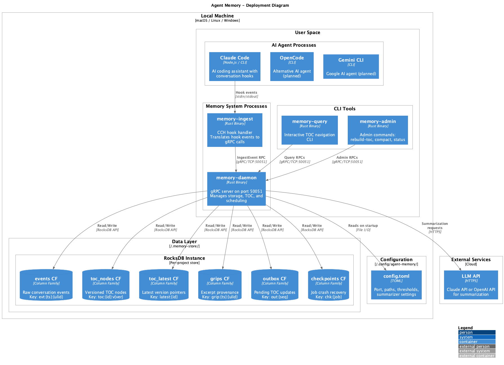
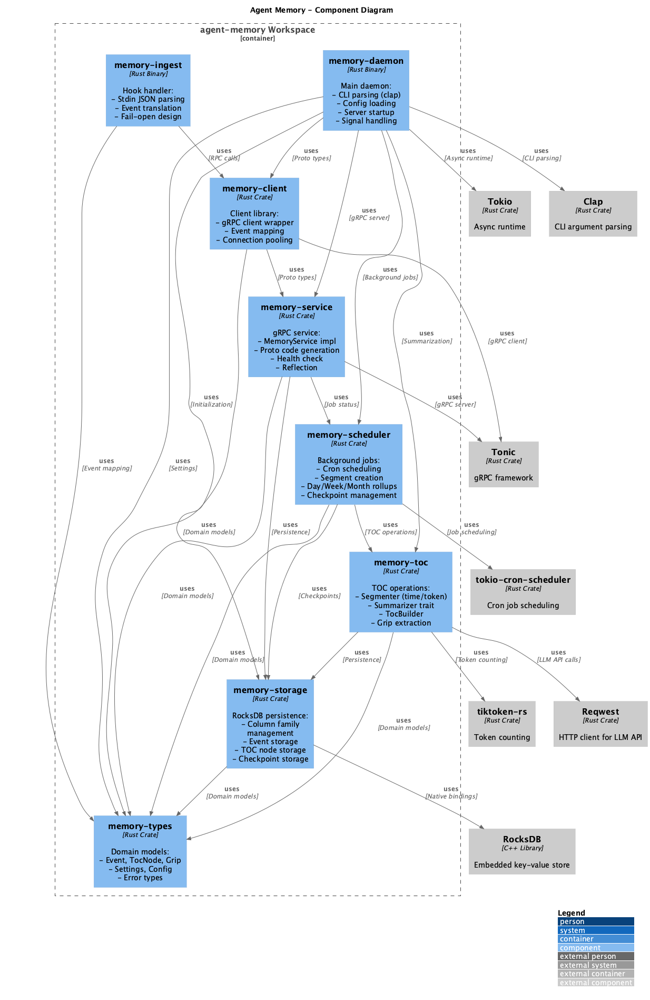
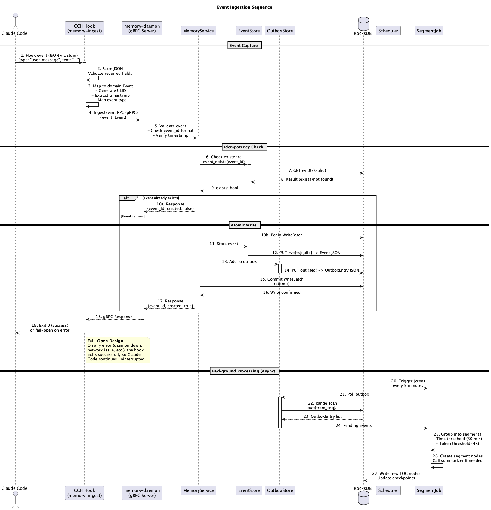
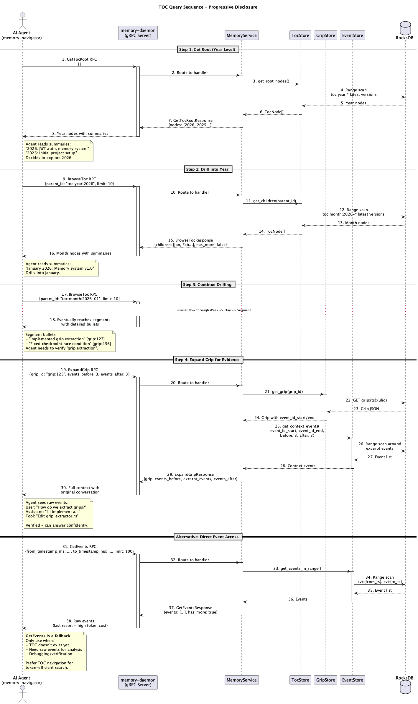
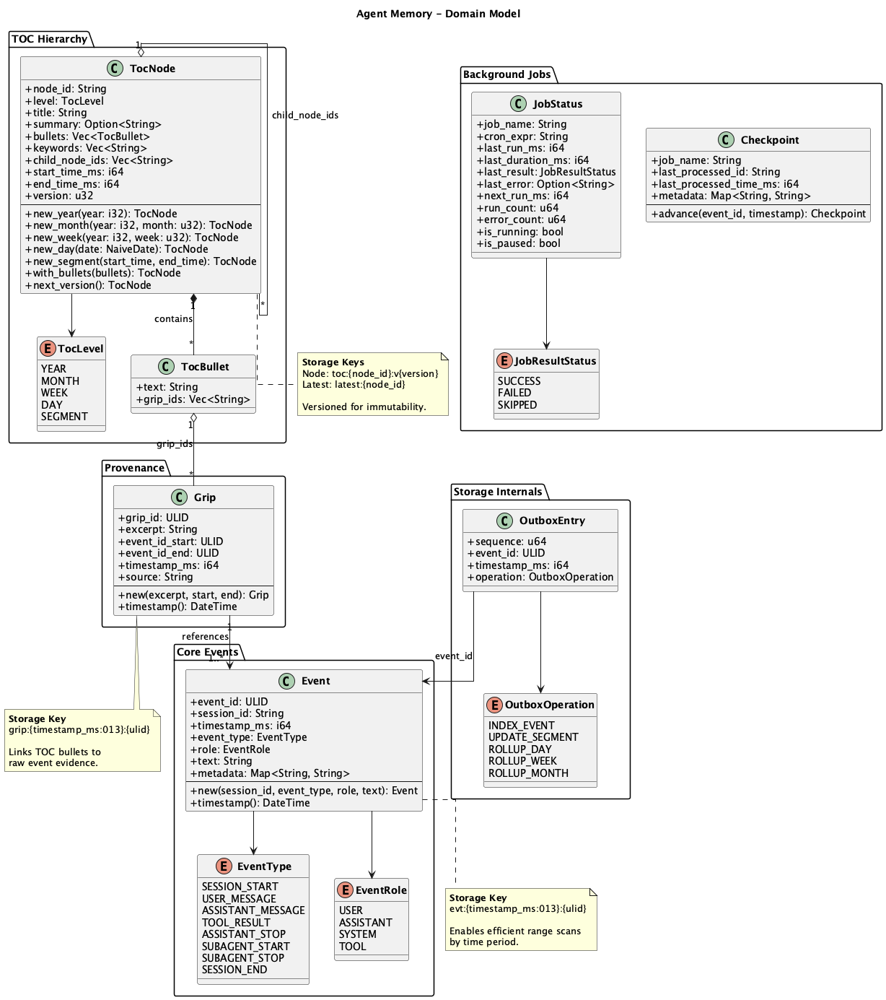
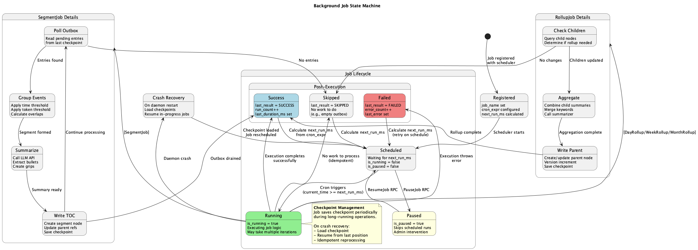

# PlantUML Diagrams

This document provides an overview of the architectural diagrams for the Agent Memory system. All diagrams are written in PlantUML and rendered as PNG images for easy viewing. Source files are preserved for editing.

## Diagram Overview

| Diagram | Image | Source | Purpose |
|---------|-------|--------|---------|
| [Deployment](#deployment-diagram) | [PNG](diagrams/deployment.png) | [PUML](diagrams/deployment.puml) | Physical deployment on local machine |
| [Components](#component-diagram) | [PNG](diagrams/components.png) | [PUML](diagrams/components.puml) | Crate structure and dependencies |
| [Ingestion Sequence](#ingestion-sequence) | [PNG](diagrams/sequence-ingest.png) | [PUML](diagrams/sequence-ingest.puml) | Event capture flow from hook to storage |
| [Query Sequence](#query-sequence) | [PNG](diagrams/sequence-query.png) | [PUML](diagrams/sequence-query.puml) | TOC navigation and grip expansion |
| [Domain Model](#domain-model) | [PNG](diagrams/class-domain.png) | [PUML](diagrams/class-domain.puml) | Core data structures and relationships |
| [Job State Machine](#job-state-machine) | [PNG](diagrams/state-job.png) | [PUML](diagrams/state-job.puml) | Background job lifecycle |

---

## Deployment Diagram



**Source:** [`diagrams/deployment.puml`](diagrams/deployment.puml)

Shows the physical deployment of Agent Memory on a local machine.

### Key Elements

- **AI Agent Processes**: Claude Code (and planned OpenCode, Gemini CLI) with conversation hooks
- **Memory Processes**: The daemon (gRPC server) and ingest handler (CCH hook)
- **CLI Tools**: Query and admin utilities for manual interaction
- **Data Layer**: RocksDB with 6 column families for different data types
- **Configuration**: TOML file in `~/.config/agent-memory/`
- **External Services**: LLM API for summarization (Claude or OpenAI)

### Data Flow

1. Claude Code emits hook events to `memory-ingest` via stdin
2. `memory-ingest` sends gRPC calls to `memory-daemon` on port 50051
3. Daemon persists to RocksDB column families
4. Background jobs process outbox and build TOC hierarchy
5. Summarization calls external LLM API when needed

---

## Component Diagram



**Source:** [`diagrams/components.puml`](diagrams/components.puml)

Shows the Rust crate structure and their dependencies.

### Crate Hierarchy

```
memory-types          (leaf crate - domain models)
    ^
    |-- memory-storage    (RocksDB persistence)
    |-- memory-toc        (segmentation, summarization)
    |-- memory-service    (gRPC implementation)
    |
    +-- memory-scheduler  (background jobs)
            |
            v
        memory-client     (client library)
            |
            v
        memory-daemon     (main binary)
        memory-ingest     (hook handler binary)
```

### External Dependencies

| Crate | External Dependency | Purpose |
|-------|---------------------|---------|
| memory-storage | RocksDB | Embedded key-value storage |
| memory-service | Tonic | gRPC server framework |
| memory-client | Tonic | gRPC client |
| memory-toc | tiktoken-rs | Token counting for segmentation |
| memory-toc | Reqwest | HTTP client for LLM API |
| memory-scheduler | tokio-cron-scheduler | Cron-based job scheduling |
| memory-daemon | Clap | CLI argument parsing |
| All | Tokio | Async runtime |

---

## Ingestion Sequence



**Source:** [`diagrams/sequence-ingest.puml`](diagrams/sequence-ingest.puml)

Details the event ingestion flow from hook capture to storage.

### Numbered Steps

1. **Hook Event Capture** (Steps 1-3): Claude Code emits JSON hook event, `memory-ingest` parses and maps to domain Event
2. **gRPC Call** (Steps 4-5): IngestEvent RPC sent to daemon, service validates
3. **Idempotency Check** (Steps 6-9): Check if event already exists (ULID lookup)
4. **Atomic Write** (Steps 10-17): WriteBatch ensures event and outbox entry are written together
5. **Response** (Steps 18-19): Success returned, hook exits (fail-open on any error)
6. **Background Processing** (Steps 20-27): Scheduler triggers segment job, processes outbox, creates TOC nodes

### Key Design Decisions

- **Fail-Open**: Hook handler never blocks Claude Code, even on errors
- **Idempotency**: Duplicate events return `created: false`, no re-processing
- **Atomic Writes**: Event + outbox in single RocksDB WriteBatch
- **Async TOC**: TOC construction happens in background, not blocking ingestion

---

## Query Sequence



**Source:** [`diagrams/sequence-query.puml`](diagrams/sequence-query.puml)

Shows the Progressive Disclosure Architecture in action.

### Navigation Steps

1. **GetTocRoot** (Steps 1-8): Agent retrieves year-level nodes with summaries
2. **Browse Year** (Steps 9-16): Drill into specific year, get month nodes
3. **Continue Drilling** (Steps 17-18): Navigate Week -> Day -> Segment
4. **ExpandGrip** (Steps 19-30): Retrieve raw events around a specific excerpt for verification

### Alternative Path

- **GetEvents** (Steps 31-38): Direct event access as fallback (high token cost)

### Progressive Disclosure Benefits

| Level | Token Cost | Information |
|-------|------------|-------------|
| Year | ~50 tokens | High-level themes |
| Month | ~100 tokens | Monthly focus areas |
| Week | ~150 tokens | Weekly activities |
| Day | ~200 tokens | Daily tasks |
| Segment | ~300 tokens | Detailed bullets with grips |
| Grip Expansion | ~500 tokens | Raw conversation excerpt |

Compare to brute-force: Loading 1000 events = ~50,000 tokens

---

## Domain Model



**Source:** [`diagrams/class-domain.puml`](diagrams/class-domain.puml)

Class diagram showing core data structures.

### Core Packages

#### Core Events
- **Event**: Conversation event with ULID, session, timestamp, type, role, text, metadata
- **EventType**: SESSION_START, USER_MESSAGE, ASSISTANT_MESSAGE, TOOL_RESULT, etc.
- **EventRole**: USER, ASSISTANT, SYSTEM, TOOL

#### TOC Hierarchy
- **TocNode**: Hierarchical node with level, title, summary, bullets, keywords, children
- **TocLevel**: YEAR, MONTH, WEEK, DAY, SEGMENT
- **TocBullet**: Summary point with text and grip references

#### Provenance
- **Grip**: Excerpt with event references (start/end), providing evidence for bullets

#### Background Jobs
- **JobStatus**: Runtime state including last run, errors, pause status
- **Checkpoint**: Crash recovery state with last processed position
- **JobResultStatus**: SUCCESS, FAILED, SKIPPED

#### Storage Internals
- **OutboxEntry**: Pending work item for background processing
- **OutboxOperation**: INDEX_EVENT, UPDATE_SEGMENT, ROLLUP_DAY, etc.

### Key Relationships

```
TocNode --(contains)--> TocBullet --(references)--> Grip --(points to)--> Event
```

---

## Job State Machine



**Source:** [`diagrams/state-job.puml`](diagrams/state-job.puml)

State diagram for background job lifecycle.

### Main States

| State | Description |
|-------|-------------|
| **Registered** | Job configured with name and cron expression |
| **Scheduled** | Waiting for next scheduled run time |
| **Running** | Actively executing job logic |
| **Paused** | Admin-paused, skips scheduled runs |
| **Success** | Completed successfully, run_count++ |
| **Failed** | Execution error, error_count++ |
| **Skipped** | No work to do (e.g., empty outbox) |

### Transitions

1. `Registered` -> `Scheduled`: Scheduler starts
2. `Scheduled` -> `Running`: Cron time reached
3. `Scheduled` -> `Paused`: PauseJob RPC
4. `Running` -> `Success`/`Failed`/`Skipped`: Execution completes
5. `Success`/`Failed`/`Skipped` -> `Scheduled`: Calculate next run
6. `Paused` -> `Scheduled`: ResumeJob RPC

### Crash Recovery

- Running job crashes -> Daemon restarts -> Load checkpoint -> Resume from last position
- Checkpoints saved periodically during long operations
- Idempotent reprocessing ensures no duplicates

### Job-Specific Details

**SegmentJob**:
1. Poll Outbox -> 2. Group Events (time/token) -> 3. Summarize (LLM) -> 4. Write TOC

**RollupJob** (Day/Week/Month):
1. Check Children -> 2. Aggregate summaries -> 3. Write Parent node

---

## Rendering Instructions

### Option 1: PlantUML Server (Online)

1. Visit [PlantUML Web Server](http://www.plantuml.com/plantuml/uml/)
2. Paste diagram source code
3. Click "Submit" to render

### Option 2: VS Code Extension

1. Install "PlantUML" extension by jebbs
2. Open `.puml` file
3. Press `Alt+D` (or `Option+D` on Mac) to preview
4. Right-click for export options (PNG, SVG, PDF)

### Option 3: Command Line

```bash
# Install PlantUML (macOS)
brew install plantuml

# Render single diagram
plantuml diagrams/deployment.puml

# Render all diagrams to PNG
plantuml diagrams/*.puml

# Render to SVG
plantuml -tsvg diagrams/*.puml
```

### Option 4: IntelliJ IDEA / RustRover

1. Install "PlantUML Integration" plugin
2. Open `.puml` file
3. Preview panel appears automatically

### C4 Model Dependencies

The deployment and component diagrams use C4-PlantUML. If rendering offline, you may need to download the C4 includes:

```bash
# Download C4-PlantUML locally
curl -O https://raw.githubusercontent.com/plantuml-stdlib/C4-PlantUML/master/C4_Deployment.puml
curl -O https://raw.githubusercontent.com/plantuml-stdlib/C4-PlantUML/master/C4_Component.puml

# Update !include to use local path
# !include C4_Deployment.puml
```

---

## Diagram Conventions

### Styling

- **C4 Model**: Used for deployment and component diagrams (industry standard)
- **Colors**: Running=Green, Paused=Yellow, Failed=Red, Success=Blue
- **Orthogonal Lines**: Used in class diagrams for cleaner layout

### Naming

- **Node IDs**: `toc:year:2026`, `toc:month:2026-01`, `toc:day:2026-01-15`
- **Storage Keys**: `evt:{ts}:{ulid}`, `grip:{ts}:{ulid}`, `toc:{id}:v{ver}`
- **Job Names**: `segment_job`, `day_rollup`, `week_rollup`, `month_rollup`

### Notes

- Each diagram includes explanatory notes for key design decisions
- Legends are included where color coding is used
- Storage key formats are documented in class diagrams
